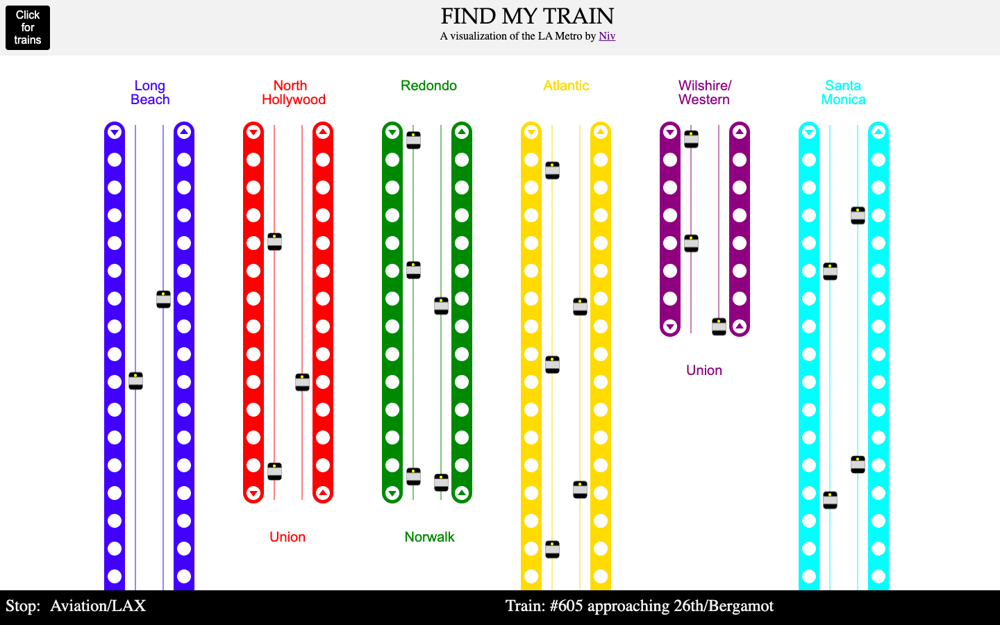

# FindMyTrain
_A JavaScript visualization of the LA-Metro Rail_

## An overview

This project's goal is to give a clean visual representation of the LA Metro Rail's current vehicular data. I carry out an initial exploration of the LA-Metro REST API in Python to understand the track layout. Further, I construct a simple projection function to locate the nearest stations of trains using their coordinates. 

I design static linear representations of the tracks and trains by employing the Canvas API and make them interactive via the Fabric JS library. Current vehicular data is accessed through the Fetch API and processed asynchronously using Promises. Finally, the train icons are rendered in their calculated positions, resulting in a complete view of all the currently running trains of the LA-Metro Rail. 

_The following notebooks contain code and more precise notes for each step of this project. If the jupyter notebooks take too long to load, please open the markdown versions, which load faster._

## Contents

### Python exploration

* Retrieving static LA Metro data : [Notebook](Python_exploration/Static_LAmetro_data_retrieval.ipynb), [Markdown](Python_exploration/Static_LAmetro_data_retrieval.md)

* Positioning current vehicles : [Notebook](Python_exploration/Positioning_currently_running_vehicles.ipynb), [Markdown](Python_exploration/Positioning_currently_running_vehicles.md)

* Storing static data as jsons : [Notebook](Python_exploration/Storing_static_data_as_json.ipynb), [Markdown](Python_exploration/Storing_static_data_as_json.md)

### Final modules

* [Static canvas](Final_modules/static_train_tracks.js)
* [Adding interactive events](Final_modules/adding_events.js)
* [Processing data from API](Final_modules/API_processing.js)
* [Static data](Final_modules/constants.js)

### Step-by-step evolution 

#### UI Design

* A static canvas : [Screenshot](UI_design/UI_design_screenshot.png), [HTML](UI_design/UI_design.html), [JS](UI_design/UI_design.js)

#### Interactive Canvas

* Using Fabric : [HTML](Fabric_events/with_fabric_events.html), [JS](Fabric_events/with_fabric_events.js)

#### Processing Data from API

* Using promises : [HTML](API_promises_and_processing/API_processing.html), [JS](API_promises_and_processing/API_processing.js), [aux JS](API_promises_and_processing/constants.js)

## A web-application
[https://nivbhaskhar.github.io/find_my_train.html](https://nivbhaskhar.github.io/find_my_train.html)

**TO DO: Sadly, the LA metro API has changed recently, and the app needs to be updated.**

