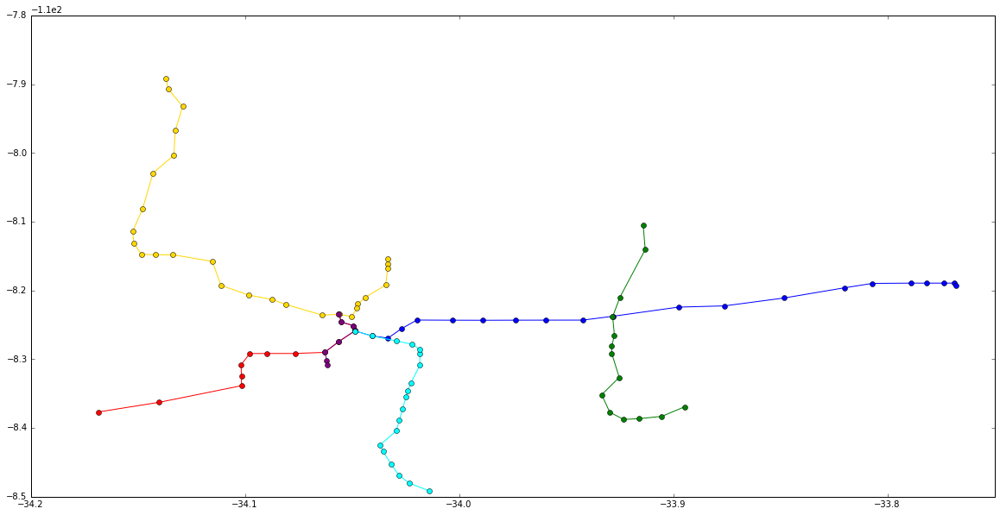
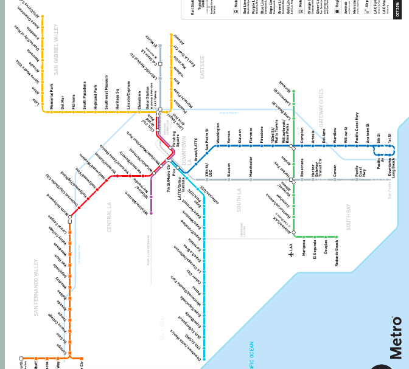
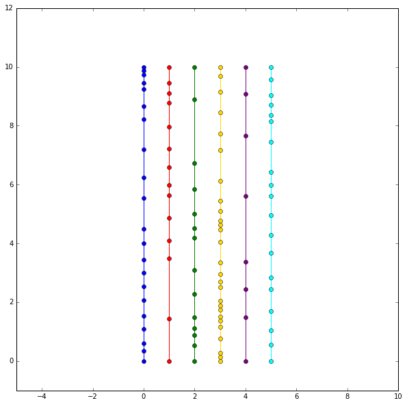
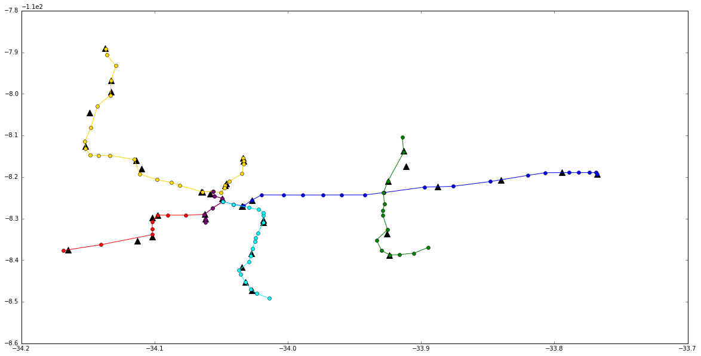

# Retreiving static metro data via LAMetro API


```python
from collections import defaultdict
import json, requests
import pprint
import math
#from collections import namedtuple
import matplotlib as mpl
import matplotlib.pyplot as plt
plt.style.use('classic')
import numpy as np
import pickle
%matplotlib inline
```


```python
#Getting all agencies
res = requests.get("https://api.metro.net/agencies/")
print(res.json())


```

    [{'localtime': '2020-08-12 17:19:58.748782', 'display_name': 'Los Angeles Metro', 'id': 'lametro'}, {'localtime': '2020-08-12 17:19:58.748801', 'display_name': 'Los Angeles Metro Rail', 'id': 'lametro-rail'}]


```python
#LA Metro agency
agency = 'lametro-rail'
```


```python
#Getting the routes
res = requests.get(f"https://api.metro.net/agencies/{agency}/routes/")
print(res.json())

```

    {'items': [{'display_name': 'Metro A Line (blue)', 'id': '801'}, {'display_name': 'Metro B Line (red)', 'id': '802'}, {'display_name': 'Metro C Line (green)', 'id': '803'}, {'display_name': 'Metro L Line (gold)', 'id': '804'}, {'display_name': 'Metro D Line (purple)', 'id': '805'}, {'display_name': 'Metro E Line (expo)', 'id': '806'}]}


```python
#Storing the routes

routes = {}
for route in res.json()['items']:
    route_data = route['display_name'].split()
    routes[route['id']] = {'name': route_data[1], 'color': route_data[3].lstrip('(').rstrip(')')}
pprint.pprint(routes)

print("")
route_tags = list(routes.keys())
routes['806']['color'] = 'cyan'
pprint.pprint(route_tags)
```

    {'801': {'color': 'blue', 'name': 'A'},
     '802': {'color': 'red', 'name': 'B'},
     '803': {'color': 'green', 'name': 'C'},
     '804': {'color': 'gold', 'name': 'L'},
     '805': {'color': 'purple', 'name': 'D'},
     '806': {'color': 'expo', 'name': 'E'}}
    
    ['801', '802', '803', '804', '805', '806']


```python
#Getting the runs for each route
for route in routes:
    res = requests.get(f"https://api.metro.net/agencies/{agency}/routes/{route}/runs/")
    print(res.json())
    print("***********")
    print()

```

    {'items': [{'id': '801_1_var0', 'direction_name': '1', 'display_in_ui': True, 'route_id': '801_1_var0', 'display_name': '801 - Downtown Long Beach Station'}, {'id': '801_0_var0', 'direction_name': '0', 'display_in_ui': True, 'route_id': '801_0_var0', 'display_name': '801 - 7th Street / Metro Center Station'}]}
    ***********
    
    {'items': [{'display_name': '802 - Union Station / Downtown La', 'direction_name': '0', 'display_in_ui': True, 'route_id': '802_0_var0', 'id': '802_0_var0'}, {'display_name': '802 - North Hollywood Station', 'direction_name': '1', 'display_in_ui': True, 'route_id': '802_1_var0', 'id': '802_1_var0'}]}
    ***********
    
    {'items': [{'display_name': '803 - Norwalk Station', 'direction_name': '0', 'display_in_ui': True, 'route_id': '803_0_var0', 'id': '803_0_var0'}, {'display_name': '803 - Redondo Beach Station', 'direction_name': '1', 'display_in_ui': True, 'route_id': '803_1_var0', 'id': '803_1_var0'}]}
    ***********
    
    {'items': [{'id': '804_0_var0', 'direction_name': '0', 'display_in_ui': True, 'route_id': '804_0_var0', 'display_name': '804 - Azusa / Citrus'}, {'id': '804_1_var0', 'direction_name': '1', 'display_in_ui': True, 'route_id': '804_1_var0', 'display_name': '804 - Atlantic Station'}]}
    ***********
    
    {'items': [{'id': '805_0_var0', 'direction_name': '0', 'display_in_ui': True, 'route_id': '805_0_var0', 'display_name': '805 - Union Station / Downtown La'}, {'id': '805_1_var0', 'direction_name': '1', 'display_in_ui': True, 'route_id': '805_1_var0', 'display_name': '805 - Wilshire / Western Station'}]}
    ***********
    
    {'items': [{'id': '806_0_var0', 'direction_name': '0', 'display_in_ui': True, 'route_id': '806_0_var0', 'display_name': '806 - 7th Street / Metro Center Station'}, {'id': '806_1_var0', 'direction_name': '1', 'display_in_ui': True, 'route_id': '806_1_var0', 'display_name': '806 - Downtown Santa Monica Station'}]}
    ***********
    


```python
#Storing the runs for each route
for route in routes:
    res = requests.get(f"https://api.metro.net/agencies/{agency}/routes/{route}/runs/")
    routes[route]['run_id'] = {}
    for run in res.json()['items']:
        routes[route]['run_id'][run['direction_name']] =  run['id']
pprint.pprint(routes)
```

    {'801': {'color': 'blue',
             'name': 'A',
             'run_id': {'0': '801_0_var0', '1': '801_1_var0'}},
     '802': {'color': 'red',
             'name': 'B',
             'run_id': {'0': '802_0_var0', '1': '802_1_var0'}},
     '803': {'color': 'green',
             'name': 'C',
             'run_id': {'0': '803_0_var0', '1': '803_1_var0'}},
     '804': {'color': 'gold',
             'name': 'L',
             'run_id': {'0': '804_0_var0', '1': '804_1_var0'}},
     '805': {'color': 'purple',
             'name': 'D',
             'run_id': {'0': '805_0_var0', '1': '805_1_var0'}},
     '806': {'color': 'cyan',
             'name': 'E',
             'run_id': {'0': '806_0_var0', '1': '806_1_var0'}}}


```python
#Getting the sequence of stops for each route
for route in routes:
    res = requests.get(f"https://api.metro.net/agencies/{agency}/routes/{route}/sequence/")
    print(res.json())
    print("***********")
    print()

```

    {'items': [{'id': '80122', 'display_name': '7th Street / Metro Center Station - Metro A Line (Blue) & E Line (Expo)', 'latitude': 34.0486099, 'longitude': -118.25882}, {'id': '80121', 'display_name': 'Pico Station', 'latitude': 34.0407299, 'longitude': -118.26612}, {'id': '80120', 'display_name': 'Grand / Lattc Station', 'latitude': 34.0331599, 'longitude': -118.26933}, {'id': '80119', 'display_name': 'San Pedro Street Station', 'latitude': 34.0268099, 'longitude': -118.2555}, {'id': '80118', 'display_name': 'Washington Station', 'latitude': 34.0196499, 'longitude': -118.24308}, {'id': '80117', 'display_name': 'Vernon Station', 'latitude': 34.0029199, 'longitude': -118.2433}, {'id': '80116', 'display_name': 'Slauson Station', 'latitude': 33.9887599, 'longitude': -118.2434}, {'id': '80115', 'display_name': 'Florence Station', 'latitude': 33.9737399, 'longitude': -118.24327}, {'id': '80114', 'display_name': 'Firestone Station', 'latitude': 33.9596099, 'longitude': -118.2432}, {'id': '80113', 'display_name': '103rd Street / Watts Towers Station', 'latitude': 33.9422199, 'longitude': -118.24316}, {'id': '80112', 'display_name': 'Willowbrook - Rosa Parks Station - Metro A Line (Blue)', 'latitude': 33.9280499, 'longitude': -118.23755}, {'id': '80111', 'display_name': 'Compton Station', 'latitude': 33.8974899, 'longitude': -118.22425}, {'id': '80110', 'display_name': 'Artesia Station', 'latitude': 33.8760799, 'longitude': -118.2225}, {'id': '80109', 'display_name': 'Del Amo Station', 'latitude': 33.8482199, 'longitude': -118.21102}, {'id': '80108', 'display_name': 'Wardlow Station', 'latitude': 33.8198599, 'longitude': -118.19609}, {'id': '80107', 'display_name': 'Willow Street Station', 'latitude': 33.8070799, 'longitude': -118.18983}, {'id': '80106', 'display_name': 'Pacific Coast Hwy Station', 'latitude': 33.7890899, 'longitude': -118.18938}, {'id': '80105', 'display_name': 'Anaheim Street Station', 'latitude': 33.7818299, 'longitude': -118.18938}, {'id': '80154', 'display_name': '5th Street Station', 'latitude': 33.7735999, 'longitude': -118.18941}, {'id': '80153', 'display_name': '1st Street Station', 'latitude': 33.7687399, 'longitude': -118.18936}, {'id': '80101', 'display_name': 'Downtown Long Beach Station', 'latitude': 33.7680699, 'longitude': -118.19292}]}
    ***********
    
    {'items': [{'display_name': 'North Hollywood Station', 'longitude': -118.37681, 'latitude': 34.1684999, 'id': '80201'}, {'display_name': 'Universal / Studio City Station', 'longitude': -118.3627, 'latitude': 34.1399999, 'id': '80202'}, {'display_name': 'Hollywood / Highland Station', 'longitude': -118.33855, 'latitude': 34.1015499, 'id': '80203'}, {'display_name': 'Hollywood / Vine Station', 'longitude': -118.32518, 'latitude': 34.1016299, 'id': '80204'}, {'display_name': 'Hollywood / Western Station', 'longitude': -118.30812, 'latitude': 34.1017399, 'id': '80205'}, {'display_name': 'Vermont / Sunset Station', 'longitude': -118.29176, 'latitude': 34.0977099, 'id': '80206'}, {'display_name': 'Vermont / Santa Monica Station', 'longitude': -118.29173, 'latitude': 34.0899099, 'id': '80207'}, {'display_name': 'Vermont / Beverly Station', 'longitude': -118.29169, 'latitude': 34.0765299, 'id': '80208'}, {'display_name': 'Wilshire / Vermont Station', 'longitude': -118.29008, 'latitude': 34.0626999, 'id': '80209'}, {'display_name': 'Westlake / Macarthur Park Station', 'longitude': -118.27488, 'latitude': 34.0563699, 'id': '80210'}, {'display_name': '7th Street / Metro Center Station - Metro Red & Purple Lines', 'longitude': -118.25868, 'latitude': 34.0486299, 'id': '80211'}, {'display_name': 'Pershing Square Station', 'longitude': -118.25126, 'latitude': 34.0493199, 'id': '80212'}, {'display_name': 'Civic Center / Grand Park Station', 'longitude': -118.24606, 'latitude': 34.0548999, 'id': '80213'}, {'display_name': 'Union Station - Metro Red & Purple Lines', 'longitude': -118.23425, 'latitude': 34.0561999, 'id': '80214'}]}
    ***********
    
    {'items': [{'display_name': 'Redondo Beach Station', 'longitude': -118.3692, 'latitude': 33.8946399, 'id': '80301'}, {'display_name': 'Douglas Station', 'longitude': -118.38311, 'latitude': 33.9052999, 'id': '80302'}, {'display_name': 'El Segundo Station', 'longitude': -118.38654, 'latitude': 33.9160599, 'id': '80303'}, {'display_name': 'Mariposa Station', 'longitude': -118.38757, 'latitude': 33.9231999, 'id': '80304'}, {'display_name': 'Aviation / Lax Station', 'longitude': -118.37713, 'latitude': 33.9296199, 'id': '80305'}, {'display_name': 'Hawthorne / Lennox Station', 'longitude': -118.3516, 'latitude': 33.9334099, 'id': '80306'}, {'display_name': 'Crenshaw Station', 'longitude': -118.32655, 'latitude': 33.9251999, 'id': '80307'}, {'display_name': 'Vermont / Athens Station', 'longitude': -118.29173, 'latitude': 33.9286799, 'id': '80308'}, {'display_name': 'Harbor Freeway Station', 'longitude': -118.2811, 'latitude': 33.9287099, 'id': '80309'}, {'display_name': 'Avalon Station', 'longitude': -118.26522, 'latitude': 33.9274599, 'id': '80310'}, {'display_name': 'Willowbrook - Rosa Parks Station - Metro Green Line', 'longitude': -118.23805, 'latitude': 33.9282599, 'id': '80311'}, {'display_name': 'Long Beach Blvd Station', 'longitude': -118.20994, 'latitude': 33.9248799, 'id': '80312'}, {'display_name': 'Lakewood Blvd Station', 'longitude': -118.1406, 'latitude': 33.9130699, 'id': '80313'}, {'display_name': 'Norwalk Station', 'longitude': -118.10472, 'latitude': 33.9140299, 'id': '80314'}]}
    ***********
    
    {'items': [{'id': '80401', 'display_name': 'Atlantic Station', 'latitude': 34.0333999, 'longitude': -118.15447}, {'id': '80402', 'display_name': 'East La Civic Center Station', 'latitude': 34.0333599, 'longitude': -118.16121}, {'id': '80403', 'display_name': 'Maravilla Station', 'latitude': 34.0333199, 'longitude': -118.16814}, {'id': '80404', 'display_name': 'Indiana Station', 'latitude': 34.0342999, 'longitude': -118.19218}, {'id': '80405', 'display_name': 'Soto Station', 'latitude': 34.0437499, 'longitude': -118.21006}, {'id': '80406', 'display_name': 'Mariachi Plaza / Boyle Heights Station', 'latitude': 34.0472199, 'longitude': -118.21965}, {'id': '80407', 'display_name': 'Pico / Aliso Station', 'latitude': 34.0476299, 'longitude': -118.22594}, {'id': '80408', 'display_name': 'Little Tokyo / Arts District Station', 'latitude': 34.0500999, 'longitude': -118.2379}, {'id': '80409', 'display_name': 'Union Station - Metro Gold Line', 'latitude': 34.0560599, 'longitude': -118.23476}, {'id': '80410', 'display_name': 'Chinatown Station', 'latitude': 34.0638599, 'longitude': -118.23584}, {'id': '80411', 'display_name': 'Lincoln Heights / Cypress Park Station', 'latitude': 34.0809499, 'longitude': -118.22043}, {'id': '80412', 'display_name': 'Heritage Square / Arroyo Station', 'latitude': 34.0872299, 'longitude': -118.21321}, {'id': '80413', 'display_name': 'Southwest Museum Station', 'latitude': 34.0982399, 'longitude': -118.20671}, {'id': '80414', 'display_name': 'Highland Park Station', 'latitude': 34.1111799, 'longitude': -118.19261}, {'id': '80415', 'display_name': 'South Pasadena Station', 'latitude': 34.1151899, 'longitude': -118.15789}, {'id': '80416', 'display_name': 'Fillmore Station', 'latitude': 34.1335199, 'longitude': -118.14813}, {'id': '80417', 'display_name': 'Del Mar Station', 'latitude': 34.1419099, 'longitude': -118.14821}, {'id': '80418', 'display_name': 'Memorial Park Station', 'latitude': 34.1483599, 'longitude': -118.14751}, {'id': '80419', 'display_name': 'Lake Station', 'latitude': 34.1518099, 'longitude': -118.13139}, {'id': '80420', 'display_name': 'Allen Station', 'latitude': 34.1524199, 'longitude': -118.11435}, {'id': '80421', 'display_name': 'Sierra Madre Villa Station', 'latitude': 34.1477499, 'longitude': -118.08121}, {'id': '80422', 'display_name': 'Arcadia Station', 'latitude': 34.1428599, 'longitude': -118.0292}, {'id': '80423', 'display_name': 'Monrovia Station', 'latitude': 34.1331599, 'longitude': -118.00347}, {'id': '80424', 'display_name': 'Duarte / City Of Hope Station', 'latitude': 34.1325199, 'longitude': -117.96768}, {'id': '80425', 'display_name': 'Irwindale Station', 'latitude': 34.1290499, 'longitude': -117.93251}, {'id': '80426', 'display_name': 'Azusa Downtown Station', 'latitude': 34.1358599, 'longitude': -117.90663}, {'id': '80427', 'display_name': 'Apu / Citrus College Station', 'latitude': 34.1368099, 'longitude': -117.89164}]}
    ***********
    
    {'items': [{'display_name': 'Union Station - Metro Red & Purple Lines', 'longitude': -118.23425, 'latitude': 34.0561999, 'id': '80214'}, {'display_name': 'Civic Center / Grand Park Station', 'longitude': -118.24606, 'latitude': 34.0548999, 'id': '80213'}, {'display_name': 'Pershing Square Station', 'longitude': -118.25126, 'latitude': 34.0493199, 'id': '80212'}, {'display_name': '7th Street / Metro Center Station - Metro Red & Purple Lines', 'longitude': -118.25868, 'latitude': 34.0486299, 'id': '80211'}, {'display_name': 'Westlake / Macarthur Park Station', 'longitude': -118.27488, 'latitude': 34.0563699, 'id': '80210'}, {'display_name': 'Wilshire / Vermont Station', 'longitude': -118.29008, 'latitude': 34.0626999, 'id': '80209'}, {'display_name': 'Wilshire / Normandie Station', 'longitude': -118.30146, 'latitude': 34.0617499, 'id': '80215'}, {'display_name': 'Wilshire / Western Station', 'longitude': -118.30876, 'latitude': 34.0616899, 'id': '80216'}]}
    ***********
    
    {'items': [{'display_name': '7th Street / Metro Center Station - Metro A Line (Blue) & E Line (Expo)', 'longitude': -118.25882, 'latitude': 34.0486099, 'id': '80122'}, {'display_name': 'Pico Station', 'longitude': -118.26612, 'latitude': 34.0407299, 'id': '80121'}, {'display_name': 'Lattc / Ortho Institute Station', 'longitude': -118.2736, 'latitude': 34.0291099, 'id': '80123'}, {'display_name': 'Jefferson / Usc Station', 'longitude': -118.27812, 'latitude': 34.0221199, 'id': '80124'}, {'display_name': 'Expo Park / Usc Station', 'longitude': -118.28573, 'latitude': 34.0182299, 'id': '80125'}, {'display_name': 'Expo / Vermont Station', 'longitude': -118.29154, 'latitude': 34.0182399, 'id': '80126'}, {'display_name': 'Expo / Western Station', 'longitude': -118.30891, 'latitude': 34.0183299, 'id': '80127'}, {'display_name': 'Expo / Crenshaw Station', 'longitude': -118.33508, 'latitude': 34.0225299, 'id': '80128'}, {'display_name': 'Farmdale Station', 'longitude': -118.34609, 'latitude': 34.0239799, 'id': '80129'}, {'display_name': 'Expo / La Brea / Ethel Bradley Station', 'longitude': -118.35516, 'latitude': 34.0247999, 'id': '80130'}, {'display_name': 'La Cienega / Jefferson Station', 'longitude': -118.37212, 'latitude': 34.0263599, 'id': '80131'}, {'display_name': 'Culver City Station', 'longitude': -118.38899, 'latitude': 34.0278999, 'id': '80132'}, {'display_name': 'Palms Station', 'longitude': -118.40425, 'latitude': 34.0293199, 'id': '80133'}, {'display_name': 'Westwood / Rancho Park Station', 'longitude': -118.42458, 'latitude': 34.0368199, 'id': '80134'}, {'display_name': 'Expo / Sepulveda Station', 'longitude': -118.43423, 'latitude': 34.0354099, 'id': '80135'}, {'display_name': 'Expo / Bundy Station', 'longitude': -118.4529, 'latitude': 34.0317099, 'id': '80136'}, {'display_name': '26th Street / Bergamot Station', 'longitude': -118.46912, 'latitude': 34.0279899, 'id': '80137'}, {'display_name': '17th Street / Smc Station', 'longitude': -118.48037, 'latitude': 34.0231599, 'id': '80138'}, {'display_name': 'Downtown Santa Monica Station', 'longitude': -118.49138, 'latitude': 34.0140099, 'id': '80139'}]}
    ***********
    


```python
#Storing the sequence of stops for each route
stops = {}
for route in routes:
    res = requests.get(f"https://api.metro.net/agencies/{agency}/routes/{route}/sequence/")
    stops[route] = []
    for stop_details in res.json()['items']:
        stops[route].append(stop_details)
pprint.pprint(stops)
```

    {'801': [{'display_name': '7th Street / Metro Center Station - Metro A Line '
                              '(Blue) & E Line (Expo)',
              'id': '80122',
              'latitude': 34.0486099,
              'longitude': -118.25882},
             {'display_name': 'Pico Station',
              'id': '80121',
              'latitude': 34.0407299,
              'longitude': -118.26612},
             {'display_name': 'Grand / Lattc Station',
              'id': '80120',
              'latitude': 34.0331599,
              'longitude': -118.26933},
             {'display_name': 'San Pedro Street Station',
              'id': '80119',
              'latitude': 34.0268099,
              'longitude': -118.2555},
             {'display_name': 'Washington Station',
              'id': '80118',
              'latitude': 34.0196499,
              'longitude': -118.24308},
             {'display_name': 'Vernon Station',
              'id': '80117',
              'latitude': 34.0029199,
              'longitude': -118.2433},
             {'display_name': 'Slauson Station',
              'id': '80116',
              'latitude': 33.9887599,
              'longitude': -118.2434},
             {'display_name': 'Florence Station',
              'id': '80115',
              'latitude': 33.9737399,
              'longitude': -118.24327},
             {'display_name': 'Firestone Station',
              'id': '80114',
              'latitude': 33.9596099,
              'longitude': -118.2432},
             {'display_name': '103rd Street / Watts Towers Station',
              'id': '80113',
              'latitude': 33.9422199,
              'longitude': -118.24316},
             {'display_name': 'Willowbrook - Rosa Parks Station - Metro A Line '
                              '(Blue)',
              'id': '80112',
              'latitude': 33.9280499,
              'longitude': -118.23755},
             {'display_name': 'Compton Station',
              'id': '80111',
              'latitude': 33.8974899,
              'longitude': -118.22425},
             {'display_name': 'Artesia Station',
              'id': '80110',
              'latitude': 33.8760799,
              'longitude': -118.2225},
             {'display_name': 'Del Amo Station',
              'id': '80109',
              'latitude': 33.8482199,
              'longitude': -118.21102},
             {'display_name': 'Wardlow Station',
              'id': '80108',
              'latitude': 33.8198599,
              'longitude': -118.19609},
             {'display_name': 'Willow Street Station',
              'id': '80107',
              'latitude': 33.8070799,
              'longitude': -118.18983},
             {'display_name': 'Pacific Coast Hwy Station',
              'id': '80106',
              'latitude': 33.7890899,
              'longitude': -118.18938},
             {'display_name': 'Anaheim Street Station',
              'id': '80105',
              'latitude': 33.7818299,
              'longitude': -118.18938},
             {'display_name': '5th Street Station',
              'id': '80154',
              'latitude': 33.7735999,
              'longitude': -118.18941},
             {'display_name': '1st Street Station',
              'id': '80153',
              'latitude': 33.7687399,
              'longitude': -118.18936},
             {'display_name': 'Downtown Long Beach Station',
              'id': '80101',
              'latitude': 33.7680699,
              'longitude': -118.19292}],
     '802': [{'display_name': 'North Hollywood Station',
              'id': '80201',
              'latitude': 34.1684999,
              'longitude': -118.37681},
             {'display_name': 'Universal / Studio City Station',
              'id': '80202',
              'latitude': 34.1399999,
              'longitude': -118.3627},
             {'display_name': 'Hollywood / Highland Station',
              'id': '80203',
              'latitude': 34.1015499,
              'longitude': -118.33855},
             {'display_name': 'Hollywood / Vine Station',
              'id': '80204',
              'latitude': 34.1016299,
              'longitude': -118.32518},
             {'display_name': 'Hollywood / Western Station',
              'id': '80205',
              'latitude': 34.1017399,
              'longitude': -118.30812},
             {'display_name': 'Vermont / Sunset Station',
              'id': '80206',
              'latitude': 34.0977099,
              'longitude': -118.29176},
             {'display_name': 'Vermont / Santa Monica Station',
              'id': '80207',
              'latitude': 34.0899099,
              'longitude': -118.29173},
             {'display_name': 'Vermont / Beverly Station',
              'id': '80208',
              'latitude': 34.0765299,
              'longitude': -118.29169},
             {'display_name': 'Wilshire / Vermont Station',
              'id': '80209',
              'latitude': 34.0626999,
              'longitude': -118.29008},
             {'display_name': 'Westlake / Macarthur Park Station',
              'id': '80210',
              'latitude': 34.0563699,
              'longitude': -118.27488},
             {'display_name': '7th Street / Metro Center Station - Metro Red & '
                              'Purple Lines',
              'id': '80211',
              'latitude': 34.0486299,
              'longitude': -118.25868},
             {'display_name': 'Pershing Square Station',
              'id': '80212',
              'latitude': 34.0493199,
              'longitude': -118.25126},
             {'display_name': 'Civic Center / Grand Park Station',
              'id': '80213',
              'latitude': 34.0548999,
              'longitude': -118.24606},
             {'display_name': 'Union Station - Metro Red & Purple Lines',
              'id': '80214',
              'latitude': 34.0561999,
              'longitude': -118.23425}],
     '803': [{'display_name': 'Redondo Beach Station',
              'id': '80301',
              'latitude': 33.8946399,
              'longitude': -118.3692},
             {'display_name': 'Douglas Station',
              'id': '80302',
              'latitude': 33.9052999,
              'longitude': -118.38311},
             {'display_name': 'El Segundo Station',
              'id': '80303',
              'latitude': 33.9160599,
              'longitude': -118.38654},
             {'display_name': 'Mariposa Station',
              'id': '80304',
              'latitude': 33.9231999,
              'longitude': -118.38757},
             {'display_name': 'Aviation / Lax Station',
              'id': '80305',
              'latitude': 33.9296199,
              'longitude': -118.37713},
             {'display_name': 'Hawthorne / Lennox Station',
              'id': '80306',
              'latitude': 33.9334099,
              'longitude': -118.3516},
             {'display_name': 'Crenshaw Station',
              'id': '80307',
              'latitude': 33.9251999,
              'longitude': -118.32655},
             {'display_name': 'Vermont / Athens Station',
              'id': '80308',
              'latitude': 33.9286799,
              'longitude': -118.29173},
             {'display_name': 'Harbor Freeway Station',
              'id': '80309',
              'latitude': 33.9287099,
              'longitude': -118.2811},
             {'display_name': 'Avalon Station',
              'id': '80310',
              'latitude': 33.9274599,
              'longitude': -118.26522},
             {'display_name': 'Willowbrook - Rosa Parks Station - Metro Green Line',
              'id': '80311',
              'latitude': 33.9282599,
              'longitude': -118.23805},
             {'display_name': 'Long Beach Blvd Station',
              'id': '80312',
              'latitude': 33.9248799,
              'longitude': -118.20994},
             {'display_name': 'Lakewood Blvd Station',
              'id': '80313',
              'latitude': 33.9130699,
              'longitude': -118.1406},
             {'display_name': 'Norwalk Station',
              'id': '80314',
              'latitude': 33.9140299,
              'longitude': -118.10472}],
     '804': [{'display_name': 'Atlantic Station',
              'id': '80401',
              'latitude': 34.0333999,
              'longitude': -118.15447},
             {'display_name': 'East La Civic Center Station',
              'id': '80402',
              'latitude': 34.0333599,
              'longitude': -118.16121},
             {'display_name': 'Maravilla Station',
              'id': '80403',
              'latitude': 34.0333199,
              'longitude': -118.16814},
             {'display_name': 'Indiana Station',
              'id': '80404',
              'latitude': 34.0342999,
              'longitude': -118.19218},
             {'display_name': 'Soto Station',
              'id': '80405',
              'latitude': 34.0437499,
              'longitude': -118.21006},
             {'display_name': 'Mariachi Plaza / Boyle Heights Station',
              'id': '80406',
              'latitude': 34.0472199,
              'longitude': -118.21965},
             {'display_name': 'Pico / Aliso Station',
              'id': '80407',
              'latitude': 34.0476299,
              'longitude': -118.22594},
             {'display_name': 'Little Tokyo / Arts District Station',
              'id': '80408',
              'latitude': 34.0500999,
              'longitude': -118.2379},
             {'display_name': 'Union Station - Metro Gold Line',
              'id': '80409',
              'latitude': 34.0560599,
              'longitude': -118.23476},
             {'display_name': 'Chinatown Station',
              'id': '80410',
              'latitude': 34.0638599,
              'longitude': -118.23584},
             {'display_name': 'Lincoln Heights / Cypress Park Station',
              'id': '80411',
              'latitude': 34.0809499,
              'longitude': -118.22043},
             {'display_name': 'Heritage Square / Arroyo Station',
              'id': '80412',
              'latitude': 34.0872299,
              'longitude': -118.21321},
             {'display_name': 'Southwest Museum Station',
              'id': '80413',
              'latitude': 34.0982399,
              'longitude': -118.20671},
             {'display_name': 'Highland Park Station',
              'id': '80414',
              'latitude': 34.1111799,
              'longitude': -118.19261},
             {'display_name': 'South Pasadena Station',
              'id': '80415',
              'latitude': 34.1151899,
              'longitude': -118.15789},
             {'display_name': 'Fillmore Station',
              'id': '80416',
              'latitude': 34.1335199,
              'longitude': -118.14813},
             {'display_name': 'Del Mar Station',
              'id': '80417',
              'latitude': 34.1419099,
              'longitude': -118.14821},
             {'display_name': 'Memorial Park Station',
              'id': '80418',
              'latitude': 34.1483599,
              'longitude': -118.14751},
             {'display_name': 'Lake Station',
              'id': '80419',
              'latitude': 34.1518099,
              'longitude': -118.13139},
             {'display_name': 'Allen Station',
              'id': '80420',
              'latitude': 34.1524199,
              'longitude': -118.11435},
             {'display_name': 'Sierra Madre Villa Station',
              'id': '80421',
              'latitude': 34.1477499,
              'longitude': -118.08121},
             {'display_name': 'Arcadia Station',
              'id': '80422',
              'latitude': 34.1428599,
              'longitude': -118.0292},
             {'display_name': 'Monrovia Station',
              'id': '80423',
              'latitude': 34.1331599,
              'longitude': -118.00347},
             {'display_name': 'Duarte / City Of Hope Station',
              'id': '80424',
              'latitude': 34.1325199,
              'longitude': -117.96768},
             {'display_name': 'Irwindale Station',
              'id': '80425',
              'latitude': 34.1290499,
              'longitude': -117.93251},
             {'display_name': 'Azusa Downtown Station',
              'id': '80426',
              'latitude': 34.1358599,
              'longitude': -117.90663},
             {'display_name': 'Apu / Citrus College Station',
              'id': '80427',
              'latitude': 34.1368099,
              'longitude': -117.89164}],
     '805': [{'display_name': 'Union Station - Metro Red & Purple Lines',
              'id': '80214',
              'latitude': 34.0561999,
              'longitude': -118.23425},
             {'display_name': 'Civic Center / Grand Park Station',
              'id': '80213',
              'latitude': 34.0548999,
              'longitude': -118.24606},
             {'display_name': 'Pershing Square Station',
              'id': '80212',
              'latitude': 34.0493199,
              'longitude': -118.25126},
             {'display_name': '7th Street / Metro Center Station - Metro Red & '
                              'Purple Lines',
              'id': '80211',
              'latitude': 34.0486299,
              'longitude': -118.25868},
             {'display_name': 'Westlake / Macarthur Park Station',
              'id': '80210',
              'latitude': 34.0563699,
              'longitude': -118.27488},
             {'display_name': 'Wilshire / Vermont Station',
              'id': '80209',
              'latitude': 34.0626999,
              'longitude': -118.29008},
             {'display_name': 'Wilshire / Normandie Station',
              'id': '80215',
              'latitude': 34.0617499,
              'longitude': -118.30146},
             {'display_name': 'Wilshire / Western Station',
              'id': '80216',
              'latitude': 34.0616899,
              'longitude': -118.30876}],
     '806': [{'display_name': '7th Street / Metro Center Station - Metro A Line '
                              '(Blue) & E Line (Expo)',
              'id': '80122',
              'latitude': 34.0486099,
              'longitude': -118.25882},
             {'display_name': 'Pico Station',
              'id': '80121',
              'latitude': 34.0407299,
              'longitude': -118.26612},
             {'display_name': 'Lattc / Ortho Institute Station',
              'id': '80123',
              'latitude': 34.0291099,
              'longitude': -118.2736},
             {'display_name': 'Jefferson / Usc Station',
              'id': '80124',
              'latitude': 34.0221199,
              'longitude': -118.27812},
             {'display_name': 'Expo Park / Usc Station',
              'id': '80125',
              'latitude': 34.0182299,
              'longitude': -118.28573},
             {'display_name': 'Expo / Vermont Station',
              'id': '80126',
              'latitude': 34.0182399,
              'longitude': -118.29154},
             {'display_name': 'Expo / Western Station',
              'id': '80127',
              'latitude': 34.0183299,
              'longitude': -118.30891},
             {'display_name': 'Expo / Crenshaw Station',
              'id': '80128',
              'latitude': 34.0225299,
              'longitude': -118.33508},
             {'display_name': 'Farmdale Station',
              'id': '80129',
              'latitude': 34.0239799,
              'longitude': -118.34609},
             {'display_name': 'Expo / La Brea / Ethel Bradley Station',
              'id': '80130',
              'latitude': 34.0247999,
              'longitude': -118.35516},
             {'display_name': 'La Cienega / Jefferson Station',
              'id': '80131',
              'latitude': 34.0263599,
              'longitude': -118.37212},
             {'display_name': 'Culver City Station',
              'id': '80132',
              'latitude': 34.0278999,
              'longitude': -118.38899},
             {'display_name': 'Palms Station',
              'id': '80133',
              'latitude': 34.0293199,
              'longitude': -118.40425},
             {'display_name': 'Westwood / Rancho Park Station',
              'id': '80134',
              'latitude': 34.0368199,
              'longitude': -118.42458},
             {'display_name': 'Expo / Sepulveda Station',
              'id': '80135',
              'latitude': 34.0354099,
              'longitude': -118.43423},
             {'display_name': 'Expo / Bundy Station',
              'id': '80136',
              'latitude': 34.0317099,
              'longitude': -118.4529},
             {'display_name': '26th Street / Bergamot Station',
              'id': '80137',
              'latitude': 34.0279899,
              'longitude': -118.46912},
             {'display_name': '17th Street / Smc Station',
              'id': '80138',
              'latitude': 34.0231599,
              'longitude': -118.48037},
             {'display_name': 'Downtown Santa Monica Station',
              'id': '80139',
              'latitude': 34.0140099,
              'longitude': -118.49138}]}


# A map plot of the LAMetro-rail routes


```python
lametro_map =plt.figure(figsize=(20,20))
for route in stops:
    current_color = routes[route]['color']
    latitudes = []
    longitudes = []
    for stop in stops[route]:
        #Horizontal flip to align with the other map
        latitudes.append(-1*stop['latitude'])
        longitudes.append(stop['longitude'])
    plt.plot(latitudes,longitudes, color=current_color, linestyle="solid", marker="o", label=route)
plt.legend();

```





Compare it to a screenshot of the 2-D map available from the official LA-metro site




```python
#Computing distances between each stop and the previous stop for each route
# (prev-current is in direction 0)
stop_coordinates_and_distances = {}
for route in stops:
    stop_coordinates_and_distances[route] = {}
    stop_sequence = [stops[route][0]['id']]
    stop_sequence_coordinates = [(stops[route][0]['latitude'], stops[route][0]['longitude'])]
    prev_stop_coordinates = np.array(list(stop_sequence_coordinates[0]))
    stop_distances = []
    widths_between_stops = []
    heights_between_stops = []
    for stop_details in stops[route][1:]:
        stop_sequence.append(stop_details['id'])
        stop_sequence_coordinates.append((stop_details['latitude'],stop_details['longitude']))
        current_stop_coordinates = np.array(list(stop_sequence_coordinates[-1]))
        distance = np.linalg.norm(current_stop_coordinates-prev_stop_coordinates)
        delta_width = stop_sequence_coordinates[-1][0]- stop_sequence_coordinates[-2][0]
        delta_height = stop_sequence_coordinates[-1][1]- stop_sequence_coordinates[-2][1]
        stop_distances.append(distance)
        widths_between_stops.append(delta_width)
        heights_between_stops.append(delta_height)
        prev_stop_coordinates = current_stop_coordinates
        
    stop_coordinates_and_distances[route]['no_of_stops'] = len(stop_sequence)     
    stop_coordinates_and_distances[route]['stop_sequence'] = stop_sequence
    stop_coordinates_and_distances[route]['stop_coordinates'] = stop_sequence_coordinates
    stop_coordinates_and_distances[route]['stop_distances'] = stop_distances
    stop_coordinates_and_distances[route]['widths_between_stops'] = widths_between_stops
    stop_coordinates_and_distances[route]['heights_between_stops'] = heights_between_stops

    
```


```python
#Range of distances between consecutive stops


for route in stop_coordinates_and_distances:
    minimum_consecutive_distance = min(stop_coordinates_and_distances[route]['stop_distances'])
    maximum_consecutive_distance = max(stop_coordinates_and_distances[route]['stop_distances'])
    stop_coordinates_and_distances[route]['min_consecutive_distance'] = minimum_consecutive_distance
    stop_coordinates_and_distances[route]['max_consecutive_distance'] = maximum_consecutive_distance
    stop_coordinates_and_distances[route]['end_to_end'] = sum(stop_coordinates_and_distances[route]['stop_distances'])
    print(f"Route {route}")
    print(f"min consecutive = {minimum_consecutive_distance}, max consecutive ={maximum_consecutive_distance}")
    print(f"end to end = {stop_coordinates_and_distances[route]['end_to_end']}")
    print()
    


```

    Route 801
    min consecutive = 0.003622499137343108, max consecutive =0.033328720347473625
    end to end = 0.31438282845947363
    
    Route 802
    min consecutive = 0.007452013150816495, max consecutive =0.04540512085657395
    end to end = 0.2209700046261227
    
    Route 803
    min consecutive = 0.007213910174100862, max consecutive =0.07033855059637988
    end to end = 0.32373748913372535
    
    Route 804
    min consecutive = 0.0063033483165620355, max consecutive =0.05223937403912474
    end to end = 0.4960366022114363
    
    Route 805
    min consecutive = 0.0073002465711790535, max consecutive =0.0179540413277875
    end to end = 0.08009994964920097
    
    Route 806
    min consecutive = 0.005810008605842361, max consecutive =0.026504884455519396
    end to end = 0.2542814340875917
    


```python
#Scaling distances between each stop and the previous stop for each route
# (prev-current is in direction 0)
#end_to_end units-> s inches, d units -> ds/end_to_end 

screen_width = 10

for route in stop_coordinates_and_distances:
    stop_distances = stop_coordinates_and_distances[route]['stop_distances'] 
    end_to_end = stop_coordinates_and_distances[route]['end_to_end']
    stop_coordinates_and_distances[route]['scaled_distances'] = list(map(lambda x: round(x*screen_width/end_to_end, 3),stop_distances))    
```


```python
for route in stop_coordinates_and_distances:
    print(f"Route {route}")
    print(stop_coordinates_and_distances[route]['scaled_distances'])
    print(f"sum of scaled distances ={sum(stop_coordinates_and_distances[route]['scaled_distances'])}")
    print()
```

    Route 801
    [0.342, 0.262, 0.484, 0.456, 0.532, 0.45, 0.478, 0.449, 0.553, 0.485, 1.06, 0.683, 0.958, 1.019, 0.453, 0.572, 0.231, 0.262, 0.155, 0.115]
    sum of scaled distances =9.998999999999999
    
    Route 802
    [1.439, 2.055, 0.605, 0.772, 0.763, 0.353, 0.606, 0.63, 0.745, 0.813, 0.337, 0.345, 0.538]
    sum of scaled distances =10.001000000000001
    
    Route 803
    [0.541, 0.349, 0.223, 0.379, 0.797, 0.814, 1.081, 0.328, 0.492, 0.84, 0.875, 2.173, 1.109]
    sum of scaled distances =10.001
    
    Route 804
    [0.136, 0.14, 0.485, 0.408, 0.206, 0.127, 0.246, 0.136, 0.159, 0.464, 0.193, 0.258, 0.386, 0.705, 0.419, 0.169, 0.131, 0.332, 0.344, 0.675, 1.053, 0.554, 0.722, 0.712, 0.539, 0.303]
    sum of scaled distances =10.001999999999999
    
    Route 805
    [1.483, 0.952, 0.93, 2.241, 2.056, 1.426, 0.911]
    sum of scaled distances =9.998999999999999
    
    Route 806
    [0.422, 0.543, 0.327, 0.336, 0.228, 0.683, 1.042, 0.437, 0.358, 0.67, 0.666, 0.603, 0.852, 0.384, 0.749, 0.654, 0.481, 0.563]
    sum of scaled distances =9.998000000000001
    


```python
pprint.pprint(stop_coordinates_and_distances)
```

    {'801': {'end_to_end': 0.31438282845947363,
             'heights_between_stops': [-0.00730000000000075,
                                       -0.0032099999999957163,
                                       0.013829999999998677,
                                       0.01241999999999166,
                                       -0.00021999999999877673,
                                       -9.99999999891088e-05,
                                       0.0001299999999986312,
                                       6.999999999379725e-05,
                                       3.999999999848569e-05,
                                       0.005610000000004334,
                                       0.013300000000000978,
                                       0.0017500000000012506,
                                       0.011479999999991719,
                                       0.014930000000006771,
                                       0.00625999999999749,
                                       0.0004500000000007276,
                                       0.0,
                                       -2.9999999995311555e-05,
                                       5.000000000165983e-05,
                                       -0.003560000000007335],
             'max_consecutive_distance': 0.033328720347473625,
             'min_consecutive_distance': 0.003622499137343108,
             'no_of_stops': 21,
             'scaled_distances': [0.342,
                                  0.262,
                                  0.484,
                                  0.456,
                                  0.532,
                                  0.45,
                                  0.478,
                                  0.449,
                                  0.553,
                                  0.485,
                                  1.06,
                                  0.683,
                                  0.958,
                                  1.019,
                                  0.453,
                                  0.572,
                                  0.231,
                                  0.262,
                                  0.155,
                                  0.115],
             'stop_coordinates': [(34.0486099, -118.25882),
                                  (34.0407299, -118.26612),
                                  (34.0331599, -118.26933),
                                  (34.0268099, -118.2555),
                                  (34.0196499, -118.24308),
                                  (34.0029199, -118.2433),
                                  (33.9887599, -118.2434),
                                  (33.9737399, -118.24327),
                                  (33.9596099, -118.2432),
                                  (33.9422199, -118.24316),
                                  (33.9280499, -118.23755),
                                  (33.8974899, -118.22425),
                                  (33.8760799, -118.2225),
                                  (33.8482199, -118.21102),
                                  (33.8198599, -118.19609),
                                  (33.8070799, -118.18983),
                                  (33.7890899, -118.18938),
                                  (33.7818299, -118.18938),
                                  (33.7735999, -118.18941),
                                  (33.7687399, -118.18936),
                                  (33.7680699, -118.19292)],
             'stop_distances': [0.010741713084979168,
                                0.008222469215508834,
                                0.015218127348656713,
                                0.014336038504408373,
                                0.016731446440754843,
                                0.0141603531029459,
                                0.015020562572686616,
                                0.014130173388888135,
                                0.017390046003388313,
                                0.015240111548149806,
                                0.033328720347473625,
                                0.021481401257828367,
                                0.030132540550043774,
                                0.03204987519476731,
                                0.014230811642346753,
                                0.017995627246637193,
                                0.007260000000002265,
                                0.00823005467782316,
                                0.0048602571948413885,
                                0.003622499137343108],
             'stop_sequence': ['80122',
                               '80121',
                               '80120',
                               '80119',
                               '80118',
                               '80117',
                               '80116',
                               '80115',
                               '80114',
                               '80113',
                               '80112',
                               '80111',
                               '80110',
                               '80109',
                               '80108',
                               '80107',
                               '80106',
                               '80105',
                               '80154',
                               '80153',
                               '80101'],
             'widths_between_stops': [-0.00788000000000011,
                                      -0.007570000000001187,
                                      -0.006349999999997635,
                                      -0.00716000000000605,
                                      -0.01672999999999547,
                                      -0.014160000000003947,
                                      -0.015019999999999811,
                                      -0.01413000000000153,
                                      -0.017389999999998906,
                                      -0.014170000000000016,
                                      -0.030560000000001253,
                                      -0.021409999999995932,
                                      -0.027860000000003993,
                                      -0.028359999999999275,
                                      -0.012779999999999347,
                                      -0.017989999999997508,
                                      -0.007260000000002265,
                                      -0.008229999999997517,
                                      -0.004860000000000753,
                                      -0.0006699999999995043]},
     '802': {'end_to_end': 0.2209700046261227,
             'heights_between_stops': [0.014110000000002287,
                                       0.02415000000000589,
                                       0.013369999999994775,
                                       0.01706000000000074,
                                       0.016360000000005925,
                                       2.9999999995311555e-05,
                                       3.999999999848569e-05,
                                       0.0016099999999994452,
                                       0.015200000000007208,
                                       0.016199999999997772,
                                       0.007419999999996207,
                                       0.005200000000002092,
                                       0.01180999999999699],
             'max_consecutive_distance': 0.04540512085657395,
             'min_consecutive_distance': 0.007452013150816495,
             'no_of_stops': 14,
             'scaled_distances': [1.439,
                                  2.055,
                                  0.605,
                                  0.772,
                                  0.763,
                                  0.353,
                                  0.606,
                                  0.63,
                                  0.745,
                                  0.813,
                                  0.337,
                                  0.345,
                                  0.538],
             'stop_coordinates': [(34.1684999, -118.37681),
                                  (34.1399999, -118.3627),
                                  (34.1015499, -118.33855),
                                  (34.1016299, -118.32518),
                                  (34.1017399, -118.30812),
                                  (34.0977099, -118.29176),
                                  (34.0899099, -118.29173),
                                  (34.0765299, -118.29169),
                                  (34.0626999, -118.29008),
                                  (34.0563699, -118.27488),
                                  (34.0486299, -118.25868),
                                  (34.0493199, -118.25126),
                                  (34.0548999, -118.24606),
                                  (34.0561999, -118.23425)],
             'stop_distances': [0.03180160530539498,
                                0.04540512085657395,
                                0.01337023933966254,
                                0.017060354627030035,
                                0.016849050418352822,
                                0.0078000576920903494,
                                0.013380059790603895,
                                0.01392339757386686,
                                0.01646538490288638,
                                0.0179540413277875,
                                0.007452013150816495,
                                0.007627345540884007,
                                0.011881334100172851],
             'stop_sequence': ['80201',
                               '80202',
                               '80203',
                               '80204',
                               '80205',
                               '80206',
                               '80207',
                               '80208',
                               '80209',
                               '80210',
                               '80211',
                               '80212',
                               '80213',
                               '80214'],
             'widths_between_stops': [-0.02850000000000108,
                                      -0.03844999999999743,
                                      7.999999999697138e-05,
                                      0.00010999999999938836,
                                      -0.0040300000000002,
                                      -0.007799999999996032,
                                      -0.013380000000005055,
                                      -0.013829999999998677,
                                      -0.0063299999999983925,
                                      -0.007739999999998304,
                                      0.0006899999999987472,
                                      0.005580000000001917,
                                      0.001300000000000523]},
     '803': {'end_to_end': 0.32373748913372535,
             'heights_between_stops': [-0.013909999999995648,
                                       -0.003429999999994493,
                                       -0.0010300000000000864,
                                       0.01044000000000267,
                                       0.025529999999989172,
                                       0.025050000000007344,
                                       0.0348199999999963,
                                       0.010630000000006135,
                                       0.015879999999995675,
                                       0.02716999999999814,
                                       0.02810999999999808,
                                       0.06933999999999685,
                                       0.03588000000000591],
             'max_consecutive_distance': 0.07033855059637988,
             'min_consecutive_distance': 0.007213910174100862,
             'no_of_stops': 14,
             'scaled_distances': [0.541,
                                  0.349,
                                  0.223,
                                  0.379,
                                  0.797,
                                  0.814,
                                  1.081,
                                  0.328,
                                  0.492,
                                  0.84,
                                  0.875,
                                  2.173,
                                  1.109],
             'stop_coordinates': [(33.8946399, -118.3692),
                                  (33.9052999, -118.38311),
                                  (33.9160599, -118.38654),
                                  (33.9231999, -118.38757),
                                  (33.9296199, -118.37713),
                                  (33.9334099, -118.3516),
                                  (33.9251999, -118.32655),
                                  (33.9286799, -118.29173),
                                  (33.9287099, -118.2811),
                                  (33.9274599, -118.26522),
                                  (33.9282599, -118.23805),
                                  (33.9248799, -118.20994),
                                  (33.9130699, -118.1406),
                                  (33.9140299, -118.10472)],
             'stop_distances': [0.01752494507837071,
                                0.011293471565462582,
                                0.007213910174100862,
                                0.012256018929490806,
                                0.02580978496616087,
                                0.026361081161445934,
                                0.03499346796188848,
                                0.010630042332941604,
                                0.015929121130805045,
                                0.02718177514438481,
                                0.028312479580564678,
                                0.07033855059637988,
                                0.035892840511729106],
             'stop_sequence': ['80301',
                               '80302',
                               '80303',
                               '80304',
                               '80305',
                               '80306',
                               '80307',
                               '80308',
                               '80309',
                               '80310',
                               '80311',
                               '80312',
                               '80313',
                               '80314'],
             'widths_between_stops': [0.010660000000001446,
                                      0.01075999999999766,
                                      0.007139999999999702,
                                      0.006419999999998538,
                                      0.0037900000000021805,
                                      -0.008209999999998274,
                                      0.003479999999996153,
                                      3.0000000002416982e-05,
                                      -0.0012499999999988631,
                                      0.0007999999999981355,
                                      -0.0033799999999999386,
                                      -0.01180999999999699,
                                      0.0009599999999991837]},
     '804': {'end_to_end': 0.4960366022114363,
             'heights_between_stops': [-0.006739999999993529,
                                       -0.006929999999996994,
                                       -0.024039999999999395,
                                       -0.017880000000005225,
                                       -0.009590000000002874,
                                       -0.006289999999992801,
                                       -0.011960000000001969,
                                       0.003140000000001919,
                                       -0.0010800000000017462,
                                       0.01541000000000281,
                                       0.007219999999989568,
                                       0.006500000000002615,
                                       0.014099999999999113,
                                       0.03472000000000719,
                                       0.009759999999999991,
                                       -8.000000001118224e-05,
                                       0.0007000000000090267,
                                       0.0161200000000008,
                                       0.017039999999994393,
                                       0.033140000000003056,
                                       0.05200999999999567,
                                       0.025730000000010023,
                                       0.03578999999999155,
                                       0.03517000000000792,
                                       0.02587999999998658,
                                       0.014990000000011605],
             'max_consecutive_distance': 0.05223937403912474,
             'min_consecutive_distance': 0.0063033483165620355,
             'no_of_stops': 27,
             'scaled_distances': [0.136,
                                  0.14,
                                  0.485,
                                  0.408,
                                  0.206,
                                  0.127,
                                  0.246,
                                  0.136,
                                  0.159,
                                  0.464,
                                  0.193,
                                  0.258,
                                  0.386,
                                  0.705,
                                  0.419,
                                  0.169,
                                  0.131,
                                  0.332,
                                  0.344,
                                  0.675,
                                  1.053,
                                  0.554,
                                  0.722,
                                  0.712,
                                  0.539,
                                  0.303],
             'stop_coordinates': [(34.0333999, -118.15447),
                                  (34.0333599, -118.16121),
                                  (34.0333199, -118.16814),
                                  (34.0342999, -118.19218),
                                  (34.0437499, -118.21006),
                                  (34.0472199, -118.21965),
                                  (34.0476299, -118.22594),
                                  (34.0500999, -118.2379),
                                  (34.0560599, -118.23476),
                                  (34.0638599, -118.23584),
                                  (34.0809499, -118.22043),
                                  (34.0872299, -118.21321),
                                  (34.0982399, -118.20671),
                                  (34.1111799, -118.19261),
                                  (34.1151899, -118.15789),
                                  (34.1335199, -118.14813),
                                  (34.1419099, -118.14821),
                                  (34.1483599, -118.14751),
                                  (34.1518099, -118.13139),
                                  (34.1524199, -118.11435),
                                  (34.1477499, -118.08121),
                                  (34.1428599, -118.0292),
                                  (34.1331599, -118.00347),
                                  (34.1325199, -117.96768),
                                  (34.1290499, -117.93251),
                                  (34.1358599, -117.90663),
                                  (34.1368099, -117.89164)],
             'stop_distances': [0.006740118693310426,
                                0.00693011543915094,
                                0.024059966749768544,
                                0.02022367177344923,
                                0.010198480278946256,
                                0.0063033483165620355,
                                0.012212391248238775,
                                0.006736556984100469,
                                0.00787441426392731,
                                0.02301165356944595,
                                0.00956905428973043,
                                0.01278554261657147,
                                0.019137753264163095,
                                0.03495080113531662,
                                0.020766475387032295,
                                0.008390381397765998,
                                0.006487873303327135,
                                0.01648505080368367,
                                0.01705091493145756,
                                0.0334674244602147,
                                0.05223937403912474,
                                0.027497688993812223,
                                0.035795721811403676,
                                0.0353407668281343,
                                0.02676098839727947,
                                0.015020073235518988],
             'stop_sequence': ['80401',
                               '80402',
                               '80403',
                               '80404',
                               '80405',
                               '80406',
                               '80407',
                               '80408',
                               '80409',
                               '80410',
                               '80411',
                               '80412',
                               '80413',
                               '80414',
                               '80415',
                               '80416',
                               '80417',
                               '80418',
                               '80419',
                               '80420',
                               '80421',
                               '80422',
                               '80423',
                               '80424',
                               '80425',
                               '80426',
                               '80427'],
             'widths_between_stops': [-3.999999999848569e-05,
                                      -3.999999999848569e-05,
                                      0.0009799999999984266,
                                      0.009450000000001069,
                                      0.003470000000000084,
                                      0.0004099999999951365,
                                      0.0024700000000024147,
                                      0.005960000000001742,
                                      0.007799999999996032,
                                      0.017090000000003158,
                                      0.006279999999996733,
                                      0.01101000000000596,
                                      0.012940000000000396,
                                      0.004009999999993852,
                                      0.018330000000005953,
                                      0.008389999999998565,
                                      0.006450000000000955,
                                      0.0034500000000008413,
                                      0.0006099999999946704,
                                      -0.004669999999997287,
                                      -0.00489000000000317,
                                      -0.009699999999995157,
                                      -0.0006400000000041928,
                                      -0.003470000000000084,
                                      0.006810000000001537,
                                      0.000950000000003115]},
     '805': {'end_to_end': 0.08009994964920097,
             'heights_between_stops': [-0.01180999999999699,
                                       -0.005200000000002092,
                                       -0.007419999999996207,
                                       -0.016199999999997772,
                                       -0.015200000000007208,
                                       -0.01138000000000261,
                                       -0.00730000000000075],
             'max_consecutive_distance': 0.0179540413277875,
             'min_consecutive_distance': 0.0073002465711790535,
             'no_of_stops': 8,
             'scaled_distances': [1.483, 0.952, 0.93, 2.241, 2.056, 1.426, 0.911],
             'stop_coordinates': [(34.0561999, -118.23425),
                                  (34.0548999, -118.24606),
                                  (34.0493199, -118.25126),
                                  (34.0486299, -118.25868),
                                  (34.0563699, -118.27488),
                                  (34.0626999, -118.29008),
                                  (34.0617499, -118.30146),
                                  (34.0616899, -118.30876)],
             'stop_distances': [0.011881334100172851,
                                0.007627345540884007,
                                0.007452013150816495,
                                0.0179540413277875,
                                0.01646538490288638,
                                0.011419584055474693,
                                0.0073002465711790535],
             'stop_sequence': ['80214',
                               '80213',
                               '80212',
                               '80211',
                               '80210',
                               '80209',
                               '80215',
                               '80216'],
             'widths_between_stops': [-0.001300000000000523,
                                      -0.005580000000001917,
                                      -0.0006899999999987472,
                                      0.007739999999998304,
                                      0.0063299999999983925,
                                      -0.0009499999999960096,
                                      -6.0000000004833964e-05]},
     '806': {'end_to_end': 0.2542814340875917,
             'heights_between_stops': [-0.00730000000000075,
                                       -0.007480000000001041,
                                       -0.004519999999999413,
                                       -0.007609999999999673,
                                       -0.005809999999996762,
                                       -0.017369999999999663,
                                       -0.026170000000007576,
                                       -0.011009999999998854,
                                       -0.009069999999994138,
                                       -0.01695999999999742,
                                       -0.016870000000011487,
                                       -0.01525999999999783,
                                       -0.02033000000000129,
                                       -0.009649999999993497,
                                       -0.018670000000000186,
                                       -0.01622000000000412,
                                       -0.011249999999989768,
                                       -0.011010000000013065],
             'max_consecutive_distance': 0.026504884455519396,
             'min_consecutive_distance': 0.005810008605842361,
             'no_of_stops': 19,
             'scaled_distances': [0.422,
                                  0.543,
                                  0.327,
                                  0.336,
                                  0.228,
                                  0.683,
                                  1.042,
                                  0.437,
                                  0.358,
                                  0.67,
                                  0.666,
                                  0.603,
                                  0.852,
                                  0.384,
                                  0.749,
                                  0.654,
                                  0.481,
                                  0.563],
             'stop_coordinates': [(34.0486099, -118.25882),
                                  (34.0407299, -118.26612),
                                  (34.0291099, -118.2736),
                                  (34.0221199, -118.27812),
                                  (34.0182299, -118.28573),
                                  (34.0182399, -118.29154),
                                  (34.0183299, -118.30891),
                                  (34.0225299, -118.33508),
                                  (34.0239799, -118.34609),
                                  (34.0247999, -118.35516),
                                  (34.0263599, -118.37212),
                                  (34.0278999, -118.38899),
                                  (34.0293199, -118.40425),
                                  (34.0368199, -118.42458),
                                  (34.0354099, -118.43423),
                                  (34.0317099, -118.4529),
                                  (34.0279899, -118.46912),
                                  (34.0231599, -118.48037),
                                  (34.0140099, -118.49138)],
             'stop_distances': [0.010741713084979168,
                                0.013819363227009782,
                                0.008324091542025487,
                                0.008546589963253328,
                                0.005810008605842361,
                                0.01737023315905657,
                                0.026504884455519396,
                                0.011105070913774938,
                                0.009106991819469773,
                                0.017031594170832273,
                                0.016940144627493093,
                                0.01532592574691403,
                                0.021669307787745708,
                                0.009752466354716341,
                                0.019033100115324605,
                                0.01664111775092476,
                                0.012243014334703432,
                                0.01431581642800665],
             'stop_sequence': ['80122',
                               '80121',
                               '80123',
                               '80124',
                               '80125',
                               '80126',
                               '80127',
                               '80128',
                               '80129',
                               '80130',
                               '80131',
                               '80132',
                               '80133',
                               '80134',
                               '80135',
                               '80136',
                               '80137',
                               '80138',
                               '80139'],
             'widths_between_stops': [-0.00788000000000011,
                                      -0.01162000000000063,
                                      -0.006990000000001828,
                                      -0.0038899999999983947,
                                      9.999999996068709e-06,
                                      9.000000000014552e-05,
                                      0.004200000000004422,
                                      0.001449999999998397,
                                      0.0008199999999973784,
                                      0.0015600000000048908,
                                      0.0015399999999985425,
                                      0.00141999999999598,
                                      0.007500000000000284,
                                      -0.0014099999999999113,
                                      -0.0036999999999949296,
                                      -0.003720000000001278,
                                      -0.004829999999998336,
                                      -0.00915000000000532]}}


# A linearized representation of the LA-Metro rail routes


```python
linearized_map =plt.figure(figsize=(10,10))
for i, route in enumerate(stops):
    current_color = routes[route]['color']
    xs = [i]
    ys = [0]
    stop_distances = stop_coordinates_and_distances[route]['scaled_distances']
    for distance in stop_distances:
        xs.append(xs[-1])
        ys.append(ys[-1]+distance)
    plt.plot(xs, ys, color=current_color, linestyle="solid", marker="o", label=route)
plt.xlim(-5,10)
plt.ylim(-1,12)
plt.legend();


```





# Current vehicular data


```python
#Getting the current vehicular data 
res = requests.get(f"https://api.metro.net/agencies/{agency}/vehicles/")
#print(res.json())
pprint.pprint(res.json()['items'][0])
for vehicle in res.json()['items']:
    print(f"Heading {vehicle['heading']}")

```

    {'heading': 90.0,
     'id': '204',
     'latitude': 34.0619439,
     'longitude': -118.298029,
     'predictable': True,
     'route_id': '805',
     'run_id': '805_0_var0',
     'seconds_since_report': 6}
    Heading 90.0
    Heading 180.0
    Heading 180.0
    Heading 270.0
    Heading 270.0
    Heading 180.0
    Heading 270.0
    Heading 0.0
    Heading 270.0
    Heading 0.0
    Heading 180.0
    Heading 0.0
    Heading 0.0
    Heading 180.0
    Heading 0.0
    Heading 0.0
    Heading 0.0
    Heading 0.0
    Heading 180.0
    Heading 90.0
    Heading 0.0
    Heading 180.0
    Heading 90.0
    Heading 180.0
    Heading 180.0
    Heading 0.0
    Heading 0.0
    Heading 270.0
    Heading 90.0
    Heading 0.0
    Heading 0.0
    Heading 90.0
    Heading 180.0
    Heading 90.0
    Heading 180.0
    Heading 180.0
    Heading 0.0


```python
#Storing current vehicular data
current_vehicles = {}
route_wise_current_vehicles = {}
for route in routes:
    route_wise_current_vehicles[route] = defaultdict(list)
res = requests.get(f"https://api.metro.net/agencies/{agency}/vehicles/")
for vehicle in res.json()['items']:
    vehicle_id = vehicle['id']
    current_vehicles[vehicle_id] = vehicle.copy()
    current_route = vehicle['route_id']
    route_wise_current_vehicles[current_route]['latitudes'].append(vehicle['latitude'])
    route_wise_current_vehicles[current_route]['longitudes'].append(vehicle['longitude'])
    route_wise_current_vehicles[current_route]['vehicle_coordinates'].append((vehicle['latitude'],vehicle['longitude']))
    route_wise_current_vehicles[current_route]['run_id'].append(vehicle['run_id'])
for route in routes:
    route_wise_current_vehicles[route]['no_of_vehicles'] = len(route_wise_current_vehicles[route]['longitudes'])
print(f"Number of current vehicles = {len(current_vehicles)}")
print()
print("*********")
pprint.pprint(current_vehicles)
pprint.pprint(route_wise_current_vehicles)
```

    Number of current vehicles = 37
    
    *********
    {'102': {'heading': 0.0,
             'id': '102',
             'latitude': 33.790072,
             'longitude': -118.189292,
             'predictable': True,
             'route_id': '801',
             'run_id': '801_0_var0',
             'seconds_since_report': 94},
     '103': {'heading': 0.0,
             'id': '103',
             'latitude': 34.049217,
             'longitude': -118.258267,
             'predictable': True,
             'route_id': '801',
             'run_id': '801_1_var0',
             'seconds_since_report': 13},
     '105': {'heading': 180.0,
             'id': '105',
             'latitude': 33.807505,
             'longitude': -118.190021,
             'predictable': True,
             'route_id': '801',
             'run_id': '801_1_var0',
             'seconds_since_report': 41},
     '106': {'heading': 180.0,
             'id': '106',
             'latitude': 34.034068,
             'longitude': -118.270511,
             'predictable': True,
             'route_id': '801',
             'run_id': '801_1_var0',
             'seconds_since_report': 3},
     '107': {'heading': 0.0,
             'id': '107',
             'latitude': 34.026831,
             'longitude': -118.255374,
             'predictable': True,
             'route_id': '801',
             'run_id': '801_0_var0',
             'seconds_since_report': 59},
     '109': {'heading': 0.0,
             'id': '109',
             'latitude': 33.768097,
             'longitude': -118.189621,
             'predictable': True,
             'route_id': '801',
             'run_id': '801_0_var0',
             'seconds_since_report': 54},
     '202': {'heading': 270.0,
             'id': '202',
             'latitude': 34.049316,
             'longitude': -118.251259,
             'predictable': True,
             'route_id': '802',
             'run_id': '802_1_var0',
             'seconds_since_report': 6},
     '203': {'heading': 270.0,
             'id': '203',
             'latitude': 34.061281,
             'longitude': -118.283221,
             'predictable': True,
             'route_id': '805',
             'run_id': '805_1_var0',
             'seconds_since_report': 6},
     '204': {'heading': 90.0,
             'id': '204',
             'latitude': 34.0619439,
             'longitude': -118.298029,
             'predictable': True,
             'route_id': '805',
             'run_id': '805_0_var0',
             'seconds_since_report': 6},
     '205': {'heading': 90.0,
             'id': '205',
             'latitude': 34.048634,
             'longitude': -118.258682,
             'predictable': True,
             'route_id': '802',
             'run_id': '802_0_var0',
             'seconds_since_report': 47},
     '206': {'heading': 90.0,
             'id': '206',
             'latitude': 34.101731,
             'longitude': -118.308635,
             'predictable': True,
             'route_id': '802',
             'run_id': '802_0_var0',
             'seconds_since_report': 6},
     '207': {'heading': 270.0,
             'id': '207',
             'latitude': 34.1011,
             'longitude': -118.291779,
             'predictable': True,
             'route_id': '802',
             'run_id': '802_1_var0',
             'seconds_since_report': 6},
     '208': {'heading': 90.0,
             'id': '208',
             'latitude': 34.056198,
             'longitude': -118.234249,
             'predictable': True,
             'route_id': '805',
             'run_id': '805_1_var0',
             'seconds_since_report': 98},
     '331': {'heading': 270.0,
             'id': '331',
             'latitude': 33.916657,
             'longitude': -118.387278,
             'predictable': True,
             'route_id': '803',
             'run_id': '803_1_var0',
             'seconds_since_report': 15},
     '332': {'heading': 270.0,
             'id': '332',
             'latitude': 33.928068,
             'longitude': -118.2543,
             'predictable': True,
             'route_id': '803',
             'run_id': '803_1_var0',
             'seconds_since_report': 15},
     '335': {'heading': 90.0,
             'id': '335',
             'latitude': 33.925019,
             'longitude': -118.210249,
             'predictable': True,
             'route_id': '803',
             'run_id': '803_0_var0',
             'seconds_since_report': 34},
     '336': {'heading': 90.0,
             'id': '336',
             'latitude': 33.933278,
             'longitude': -118.356846,
             'predictable': True,
             'route_id': '803',
             'run_id': '803_0_var0',
             'seconds_since_report': 15},
     '401': {'heading': 0.0,
             'id': '401',
             'latitude': 34.112163,
             'longitude': -118.189247,
             'predictable': True,
             'route_id': '804',
             'run_id': '804_0_var0',
             'seconds_since_report': 12},
     '402': {'heading': 0.0,
             'id': '402',
             'latitude': 34.063861,
             'longitude': -118.23584,
             'predictable': True,
             'route_id': '804',
             'run_id': '804_0_var0',
             'seconds_since_report': 3},
     '403': {'heading': 0.0,
             'id': '403',
             'latitude': 34.043807,
             'longitude': -118.209999,
             'predictable': True,
             'route_id': '804',
             'run_id': '804_0_var0',
             'seconds_since_report': 3},
     '405': {'heading': 180.0,
             'id': '405',
             'latitude': 34.033395,
             'longitude': -118.154466,
             'predictable': True,
             'route_id': '804',
             'run_id': '804_0_var0',
             'seconds_since_report': 62},
     '406': {'heading': 180.0,
             'id': '406',
             'latitude': 34.047634,
             'longitude': -118.22594,
             'predictable': True,
             'route_id': '804',
             'run_id': '804_1_var0',
             'seconds_since_report': 3},
     '407': {'heading': 180.0,
             'id': '407',
             'latitude': 34.127413,
             'longitude': -118.147999,
             'predictable': True,
             'route_id': '804',
             'run_id': '804_1_var0',
             'seconds_since_report': 3},
     '408': {'heading': 180.0,
             'id': '408',
             'latitude': 34.081802,
             'longitude': -118.219223,
             'predictable': True,
             'route_id': '804',
             'run_id': '804_1_var0',
             'seconds_since_report': 12},
     '409': {'heading': 180.0,
             'id': '409',
             'latitude': 34.133057,
             'longitude': -118.003055,
             'predictable': True,
             'route_id': '804',
             'run_id': '804_1_var0',
             'seconds_since_report': 264},
     '410': {'heading': 180.0,
             'id': '410',
             'latitude': 34.132488,
             'longitude': -117.975868,
             'predictable': True,
             'route_id': '804',
             'run_id': '804_1_var0',
             'seconds_since_report': 12},
     '411': {'heading': 0.0,
             'id': '411',
             'latitude': 34.136746,
             'longitude': -117.901636,
             'predictable': True,
             'route_id': '804',
             'run_id': '804_0_var0',
             'seconds_since_report': 23},
     '412': {'heading': 0.0,
             'id': '412',
             'latitude': 34.136759,
             'longitude': -118.016578,
             'predictable': True,
             'route_id': '804',
             'run_id': '804_0_var0',
             'seconds_since_report': 12},
     '413': {'heading': 0.0,
             'id': '413',
             'latitude': 34.1512,
             'longitude': -118.1461,
             'predictable': True,
             'route_id': '804',
             'run_id': '804_0_var0',
             'seconds_since_report': 103},
     '602': {'heading': 180.0,
             'id': '602',
             'latitude': 34.027724,
             'longitude': -118.386941,
             'predictable': True,
             'route_id': '806',
             'run_id': '806_1_var0',
             'seconds_since_report': 3},
     '603': {'heading': 180.0,
             'id': '603',
             'latitude': 34.0183449,
             'longitude': -118.30991,
             'predictable': True,
             'route_id': '806',
             'run_id': '806_1_var0',
             'seconds_since_report': 12},
     '604': {'heading': 180.0,
             'id': '604',
             'latitude': 34.040995,
             'longitude': -118.265869,
             'predictable': True,
             'route_id': '806',
             'run_id': '806_1_var0',
             'seconds_since_report': 71},
     '605': {'heading': 0.0,
             'id': '605',
             'latitude': 34.025297,
             'longitude': -118.476005,
             'predictable': True,
             'route_id': '806',
             'run_id': '806_0_var0',
             'seconds_since_report': 3},
     '606': {'heading': 0.0,
             'id': '606',
             'latitude': 34.018233,
             'longitude': -118.300267,
             'predictable': True,
             'route_id': '806',
             'run_id': '806_0_var0',
             'seconds_since_report': 41},
     '607': {'heading': 0.0,
             'id': '607',
             'latitude': 34.042898,
             'longitude': -118.26408,
             'predictable': True,
             'route_id': '806',
             'run_id': '806_0_var0',
             'seconds_since_report': 12},
     '608': {'heading': 0.0,
             'id': '608',
             'latitude': 34.028825,
             'longitude': -118.398354,
             'predictable': True,
             'route_id': '806',
             'run_id': '806_0_var0',
             'seconds_since_report': 12},
     '609': {'heading': 180.0,
             'id': '609',
             'latitude': 34.02292,
             'longitude': -118.480734,
             'predictable': True,
             'route_id': '806',
             'run_id': '806_1_var0',
             'seconds_since_report': 23}}
    {'801': defaultdict(<class 'list'>,
                        {'latitudes': [33.807505,
                                       34.034068,
                                       34.026831,
                                       33.768097,
                                       34.049217,
                                       33.790072],
                         'longitudes': [-118.190021,
                                        -118.270511,
                                        -118.255374,
                                        -118.189621,
                                        -118.258267,
                                        -118.189292],
                         'no_of_vehicles': 6,
                         'run_id': ['801_1_var0',
                                    '801_1_var0',
                                    '801_0_var0',
                                    '801_0_var0',
                                    '801_1_var0',
                                    '801_0_var0'],
                         'vehicle_coordinates': [(33.807505, -118.190021),
                                                 (34.034068, -118.270511),
                                                 (34.026831, -118.255374),
                                                 (33.768097, -118.189621),
                                                 (34.049217, -118.258267),
                                                 (33.790072, -118.189292)]}),
     '802': defaultdict(<class 'list'>,
                        {'latitudes': [34.049316, 34.1011, 34.101731, 34.048634],
                         'longitudes': [-118.251259,
                                        -118.291779,
                                        -118.308635,
                                        -118.258682],
                         'no_of_vehicles': 4,
                         'run_id': ['802_1_var0',
                                    '802_1_var0',
                                    '802_0_var0',
                                    '802_0_var0'],
                         'vehicle_coordinates': [(34.049316, -118.251259),
                                                 (34.1011, -118.291779),
                                                 (34.101731, -118.308635),
                                                 (34.048634, -118.258682)]}),
     '803': defaultdict(<class 'list'>,
                        {'latitudes': [33.928068, 33.916657, 33.925019, 33.933278],
                         'longitudes': [-118.2543,
                                        -118.387278,
                                        -118.210249,
                                        -118.356846],
                         'no_of_vehicles': 4,
                         'run_id': ['803_1_var0',
                                    '803_1_var0',
                                    '803_0_var0',
                                    '803_0_var0'],
                         'vehicle_coordinates': [(33.928068, -118.2543),
                                                 (33.916657, -118.387278),
                                                 (33.925019, -118.210249),
                                                 (33.933278, -118.356846)]}),
     '804': defaultdict(<class 'list'>,
                        {'latitudes': [34.047634,
                                       34.112163,
                                       34.136746,
                                       34.127413,
                                       34.1512,
                                       34.136759,
                                       34.063861,
                                       34.033395,
                                       34.132488,
                                       34.043807,
                                       34.081802,
                                       34.133057],
                         'longitudes': [-118.22594,
                                        -118.189247,
                                        -117.901636,
                                        -118.147999,
                                        -118.1461,
                                        -118.016578,
                                        -118.23584,
                                        -118.154466,
                                        -117.975868,
                                        -118.209999,
                                        -118.219223,
                                        -118.003055],
                         'no_of_vehicles': 12,
                         'run_id': ['804_1_var0',
                                    '804_0_var0',
                                    '804_0_var0',
                                    '804_1_var0',
                                    '804_0_var0',
                                    '804_0_var0',
                                    '804_0_var0',
                                    '804_0_var0',
                                    '804_1_var0',
                                    '804_0_var0',
                                    '804_1_var0',
                                    '804_1_var0'],
                         'vehicle_coordinates': [(34.047634, -118.22594),
                                                 (34.112163, -118.189247),
                                                 (34.136746, -117.901636),
                                                 (34.127413, -118.147999),
                                                 (34.1512, -118.1461),
                                                 (34.136759, -118.016578),
                                                 (34.063861, -118.23584),
                                                 (34.033395, -118.154466),
                                                 (34.132488, -117.975868),
                                                 (34.043807, -118.209999),
                                                 (34.081802, -118.219223),
                                                 (34.133057, -118.003055)]}),
     '805': defaultdict(<class 'list'>,
                        {'latitudes': [34.0619439, 34.061281, 34.056198],
                         'longitudes': [-118.298029, -118.283221, -118.234249],
                         'no_of_vehicles': 3,
                         'run_id': ['805_0_var0', '805_1_var0', '805_1_var0'],
                         'vehicle_coordinates': [(34.0619439, -118.298029),
                                                 (34.061281, -118.283221),
                                                 (34.056198, -118.234249)]}),
     '806': defaultdict(<class 'list'>,
                        {'latitudes': [34.040995,
                                       34.042898,
                                       34.025297,
                                       34.018233,
                                       34.0183449,
                                       34.027724,
                                       34.028825,
                                       34.02292],
                         'longitudes': [-118.265869,
                                        -118.26408,
                                        -118.476005,
                                        -118.300267,
                                        -118.30991,
                                        -118.386941,
                                        -118.398354,
                                        -118.480734],
                         'no_of_vehicles': 8,
                         'run_id': ['806_1_var0',
                                    '806_0_var0',
                                    '806_0_var0',
                                    '806_0_var0',
                                    '806_1_var0',
                                    '806_1_var0',
                                    '806_0_var0',
                                    '806_1_var0'],
                         'vehicle_coordinates': [(34.040995, -118.265869),
                                                 (34.042898, -118.26408),
                                                 (34.025297, -118.476005),
                                                 (34.018233, -118.300267),
                                                 (34.0183449, -118.30991),
                                                 (34.027724, -118.386941),
                                                 (34.028825, -118.398354),
                                                 (34.02292, -118.480734)]})}


# Rough display of current vehicles in the map plot 


```python
lametro_map_with_current_vehicles =plt.figure(figsize=(30,20))
for route in routes:
    current_color = routes[route]['color']
    latitudes = []
    longitudes = []
    for stop in stops[route]:
        #Horizontal flip to align with the other map
        latitudes.append(-1*stop['latitude'])
        longitudes.append(stop['longitude'])
    current_vehicles_latitudes = list(map(lambda x: -1*x, route_wise_current_vehicles[route]['latitudes']))
    current_vehicles_longitudes = route_wise_current_vehicles[route]['longitudes']
    plt.plot(latitudes,longitudes, color=current_color, linestyle='solid', marker="o", label=route)
    plt.scatter(current_vehicles_latitudes, current_vehicles_longitudes, color ="black", marker ="^", s=100)
plt.legend();


```





# Picking the retrieved data
                  


```python
#Open the blank file where you'd like to save your data in append mode (binary format)
static_LAmetro_data_fileobj = open('static_LAmetro_data', 'ab') 

#Collect all data to be pickled into one container
static_data = {'routes': routes, 'stops': stops, 
               'stop_coordinates_and_distances' : stop_coordinates_and_distances,
               'current_vehicles' : current_vehicles,
              'route_wise_current_vehicles' : route_wise_current_vehicles}

# Dump pickled data 
pickle.dump(static_data,static_LAmetro_data_fileobj)


```


```python

```
