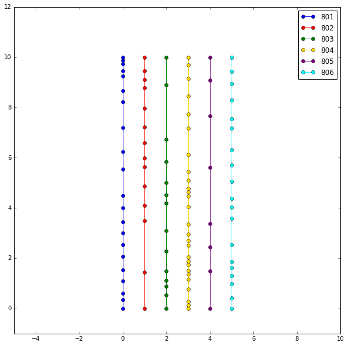

# Retreiving static metro data via LAMetro API


```python
from collections import defaultdict
import json, requests
import pprint
import math
#from collections import namedtuple
import matplotlib as mpl
import matplotlib.pyplot as plt
plt.style.use('classic')
import numpy as np
#from scipy.interpolate import interp1d

%matplotlib inline
```


```python
#Getting all agencies
res = requests.get("https://api.metro.net/agencies/")
print(res.json())


```

    [{'id': 'lametro', 'localtime': '2020-08-11 21:18:55.255394', 'display_name': 'Los Angeles Metro'}, {'id': 'lametro-rail', 'localtime': '2020-08-11 21:18:55.255413', 'display_name': 'Los Angeles Metro Rail'}]


```python
#LA Metro agency
agency = 'lametro-rail'
```


```python
#Getting the routes
res = requests.get(f"https://api.metro.net/agencies/{agency}/routes/")
print(res.json())

```

    {'items': [{'display_name': 'Metro A Line (blue)', 'id': '801'}, {'display_name': 'Metro B Line (red)', 'id': '802'}, {'display_name': 'Metro C Line (green)', 'id': '803'}, {'display_name': 'Metro L Line (gold)', 'id': '804'}, {'display_name': 'Metro D Line (purple)', 'id': '805'}, {'display_name': 'Metro E Line (expo)', 'id': '806'}]}


```python
#Storing the routes

routes = {}
for route in res.json()['items']:
    route_data = route['display_name'].split()
    routes[route['id']] = {'name': route_data[1], 'color': route_data[3].lstrip('(').rstrip(')')}
pprint.pprint(routes)

print("")
route_tags = list(routes.keys())
routes['806']['color'] = 'cyan'
pprint.pprint(route_tags)
```

    {'801': {'color': 'blue', 'name': 'A'},
     '802': {'color': 'red', 'name': 'B'},
     '803': {'color': 'green', 'name': 'C'},
     '804': {'color': 'gold', 'name': 'L'},
     '805': {'color': 'purple', 'name': 'D'},
     '806': {'color': 'expo', 'name': 'E'}}
    
    ['801', '802', '803', '804', '805', '806']


```python
#Getting the runs for each route
for route in routes:
    res = requests.get(f"https://api.metro.net/agencies/{agency}/routes/{route}/runs/")
    print(res.json())
    print("***********")
    print()

```

    {'items': [{'display_name': '801 - Downtown Long Beach Station', 'direction_name': '1', 'display_in_ui': True, 'route_id': '801_1_var0', 'id': '801_1_var0'}, {'display_name': '801 - 7th Street / Metro Center Station', 'direction_name': '0', 'display_in_ui': True, 'route_id': '801_0_var0', 'id': '801_0_var0'}]}
    ***********
    
    {'items': [{'id': '802_0_var0', 'direction_name': '0', 'display_in_ui': True, 'route_id': '802_0_var0', 'display_name': '802 - Union Station / Downtown La'}, {'id': '802_1_var0', 'direction_name': '1', 'display_in_ui': True, 'route_id': '802_1_var0', 'display_name': '802 - North Hollywood Station'}]}
    ***********
    
    {'items': [{'display_name': '803 - Norwalk Station', 'direction_name': '0', 'display_in_ui': True, 'route_id': '803_0_var0', 'id': '803_0_var0'}, {'display_name': '803 - Redondo Beach Station', 'direction_name': '1', 'display_in_ui': True, 'route_id': '803_1_var0', 'id': '803_1_var0'}]}
    ***********
    
    {'items': [{'display_name': '804 - Azusa / Citrus', 'direction_name': '0', 'display_in_ui': True, 'route_id': '804_0_var0', 'id': '804_0_var0'}, {'display_name': '804 - Atlantic Station', 'direction_name': '1', 'display_in_ui': True, 'route_id': '804_1_var0', 'id': '804_1_var0'}]}
    ***********
    
    {'items': [{'display_name': '805 - Wilshire / Western Station', 'direction_name': '1', 'display_in_ui': True, 'route_id': '805_1_var0', 'id': '805_1_var0'}, {'display_name': '805 - Union Station / Downtown La', 'direction_name': '0', 'display_in_ui': True, 'route_id': '805_0_var0', 'id': '805_0_var0'}]}
    ***********
    
    {'items': [{'id': '806_0_var0', 'direction_name': '0', 'display_in_ui': True, 'route_id': '806_0_var0', 'display_name': '806 - 7th Street / Metro Center Station'}, {'id': '806_1_var0', 'direction_name': '1', 'display_in_ui': True, 'route_id': '806_1_var0', 'display_name': '806 - Downtown Santa Monica Station'}]}
    ***********
    


```python
#Storing the runs for each route
for route in routes:
    res = requests.get(f"https://api.metro.net/agencies/{agency}/routes/{route}/runs/")
    routes[route]['run_id'] = {}
    for run in res.json()['items']:
        routes[route]['run_id'][run['direction_name']] =  run['id']
pprint.pprint(routes)
```

    {'801': {'color': 'blue',
             'name': 'A',
             'run_id': {'0': '801_0_var0', '1': '801_1_var0'}},
     '802': {'color': 'red',
             'name': 'B',
             'run_id': {'0': '802_0_var0', '1': '802_1_var0'}},
     '803': {'color': 'green',
             'name': 'C',
             'run_id': {'0': '803_0_var0', '1': '803_1_var0'}},
     '804': {'color': 'gold',
             'name': 'L',
             'run_id': {'0': '804_0_var0', '1': '804_1_var0'}},
     '805': {'color': 'purple',
             'name': 'D',
             'run_id': {'0': '805_0_var0', '1': '805_1_var0'}},
     '806': {'color': 'cyan',
             'name': 'E',
             'run_id': {'0': '806_0_var0', '1': '806_1_var0'}}}


```python
#Getting the sequence of stops for each route
for route in routes:
    res = requests.get(f"https://api.metro.net/agencies/{agency}/routes/{route}/sequence/")
    print(res.json())
    print("***********")
    print()

```

    {'items': [{'display_name': '7th Street / Metro Center Station - Metro A Line (Blue) & E Line (Expo)', 'longitude': -118.25882, 'latitude': 34.0486099, 'id': '80122'}, {'display_name': 'Pico Station', 'longitude': -118.26612, 'latitude': 34.0407299, 'id': '80121'}, {'display_name': 'Grand / Lattc Station', 'longitude': -118.26933, 'latitude': 34.0331599, 'id': '80120'}, {'display_name': 'San Pedro Street Station', 'longitude': -118.2555, 'latitude': 34.0268099, 'id': '80119'}, {'display_name': 'Washington Station', 'longitude': -118.24308, 'latitude': 34.0196499, 'id': '80118'}, {'display_name': 'Vernon Station', 'longitude': -118.2433, 'latitude': 34.0029199, 'id': '80117'}, {'display_name': 'Slauson Station', 'longitude': -118.2434, 'latitude': 33.9887599, 'id': '80116'}, {'display_name': 'Florence Station', 'longitude': -118.24327, 'latitude': 33.9737399, 'id': '80115'}, {'display_name': 'Firestone Station', 'longitude': -118.2432, 'latitude': 33.9596099, 'id': '80114'}, {'display_name': '103rd Street / Watts Towers Station', 'longitude': -118.24316, 'latitude': 33.9422199, 'id': '80113'}, {'display_name': 'Willowbrook - Rosa Parks Station - Metro A Line (Blue)', 'longitude': -118.23755, 'latitude': 33.9280499, 'id': '80112'}, {'display_name': 'Compton Station', 'longitude': -118.22425, 'latitude': 33.8974899, 'id': '80111'}, {'display_name': 'Artesia Station', 'longitude': -118.2225, 'latitude': 33.8760799, 'id': '80110'}, {'display_name': 'Del Amo Station', 'longitude': -118.21102, 'latitude': 33.8482199, 'id': '80109'}, {'display_name': 'Wardlow Station', 'longitude': -118.19609, 'latitude': 33.8198599, 'id': '80108'}, {'display_name': 'Willow Street Station', 'longitude': -118.18983, 'latitude': 33.8070799, 'id': '80107'}, {'display_name': 'Pacific Coast Hwy Station', 'longitude': -118.18938, 'latitude': 33.7890899, 'id': '80106'}, {'display_name': 'Anaheim Street Station', 'longitude': -118.18938, 'latitude': 33.7818299, 'id': '80105'}, {'display_name': '5th Street Station', 'longitude': -118.18941, 'latitude': 33.7735999, 'id': '80154'}, {'display_name': '1st Street Station', 'longitude': -118.18936, 'latitude': 33.7687399, 'id': '80153'}, {'display_name': 'Downtown Long Beach Station', 'longitude': -118.19292, 'latitude': 33.7680699, 'id': '80101'}]}
    ***********
    
    {'items': [{'id': '80201', 'display_name': 'North Hollywood Station', 'latitude': 34.1684999, 'longitude': -118.37681}, {'id': '80202', 'display_name': 'Universal / Studio City Station', 'latitude': 34.1399999, 'longitude': -118.3627}, {'id': '80203', 'display_name': 'Hollywood / Highland Station', 'latitude': 34.1015499, 'longitude': -118.33855}, {'id': '80204', 'display_name': 'Hollywood / Vine Station', 'latitude': 34.1016299, 'longitude': -118.32518}, {'id': '80205', 'display_name': 'Hollywood / Western Station', 'latitude': 34.1017399, 'longitude': -118.30812}, {'id': '80206', 'display_name': 'Vermont / Sunset Station', 'latitude': 34.0977099, 'longitude': -118.29176}, {'id': '80207', 'display_name': 'Vermont / Santa Monica Station', 'latitude': 34.0899099, 'longitude': -118.29173}, {'id': '80208', 'display_name': 'Vermont / Beverly Station', 'latitude': 34.0765299, 'longitude': -118.29169}, {'id': '80209', 'display_name': 'Wilshire / Vermont Station', 'latitude': 34.0626999, 'longitude': -118.29008}, {'id': '80210', 'display_name': 'Westlake / Macarthur Park Station', 'latitude': 34.0563699, 'longitude': -118.27488}, {'id': '80211', 'display_name': '7th Street / Metro Center Station - Metro Red & Purple Lines', 'latitude': 34.0486299, 'longitude': -118.25868}, {'id': '80212', 'display_name': 'Pershing Square Station', 'latitude': 34.0493199, 'longitude': -118.25126}, {'id': '80213', 'display_name': 'Civic Center / Grand Park Station', 'latitude': 34.0548999, 'longitude': -118.24606}, {'id': '80214', 'display_name': 'Union Station - Metro Red & Purple Lines', 'latitude': 34.0561999, 'longitude': -118.23425}]}
    ***********
    
    {'items': [{'display_name': 'Redondo Beach Station', 'longitude': -118.3692, 'latitude': 33.8946399, 'id': '80301'}, {'display_name': 'Douglas Station', 'longitude': -118.38311, 'latitude': 33.9052999, 'id': '80302'}, {'display_name': 'El Segundo Station', 'longitude': -118.38654, 'latitude': 33.9160599, 'id': '80303'}, {'display_name': 'Mariposa Station', 'longitude': -118.38757, 'latitude': 33.9231999, 'id': '80304'}, {'display_name': 'Aviation / Lax Station', 'longitude': -118.37713, 'latitude': 33.9296199, 'id': '80305'}, {'display_name': 'Hawthorne / Lennox Station', 'longitude': -118.3516, 'latitude': 33.9334099, 'id': '80306'}, {'display_name': 'Crenshaw Station', 'longitude': -118.32655, 'latitude': 33.9251999, 'id': '80307'}, {'display_name': 'Vermont / Athens Station', 'longitude': -118.29173, 'latitude': 33.9286799, 'id': '80308'}, {'display_name': 'Harbor Freeway Station', 'longitude': -118.2811, 'latitude': 33.9287099, 'id': '80309'}, {'display_name': 'Avalon Station', 'longitude': -118.26522, 'latitude': 33.9274599, 'id': '80310'}, {'display_name': 'Willowbrook - Rosa Parks Station - Metro Green Line', 'longitude': -118.23805, 'latitude': 33.9282599, 'id': '80311'}, {'display_name': 'Long Beach Blvd Station', 'longitude': -118.20994, 'latitude': 33.9248799, 'id': '80312'}, {'display_name': 'Lakewood Blvd Station', 'longitude': -118.1406, 'latitude': 33.9130699, 'id': '80313'}, {'display_name': 'Norwalk Station', 'longitude': -118.10472, 'latitude': 33.9140299, 'id': '80314'}]}
    ***********
    
    {'items': [{'id': '80401', 'display_name': 'Atlantic Station', 'latitude': 34.0333999, 'longitude': -118.15447}, {'id': '80402', 'display_name': 'East La Civic Center Station', 'latitude': 34.0333599, 'longitude': -118.16121}, {'id': '80403', 'display_name': 'Maravilla Station', 'latitude': 34.0333199, 'longitude': -118.16814}, {'id': '80404', 'display_name': 'Indiana Station', 'latitude': 34.0342999, 'longitude': -118.19218}, {'id': '80405', 'display_name': 'Soto Station', 'latitude': 34.0437499, 'longitude': -118.21006}, {'id': '80406', 'display_name': 'Mariachi Plaza / Boyle Heights Station', 'latitude': 34.0472199, 'longitude': -118.21965}, {'id': '80407', 'display_name': 'Pico / Aliso Station', 'latitude': 34.0476299, 'longitude': -118.22594}, {'id': '80408', 'display_name': 'Little Tokyo / Arts District Station', 'latitude': 34.0500999, 'longitude': -118.2379}, {'id': '80409', 'display_name': 'Union Station - Metro Gold Line', 'latitude': 34.0560599, 'longitude': -118.23476}, {'id': '80410', 'display_name': 'Chinatown Station', 'latitude': 34.0638599, 'longitude': -118.23584}, {'id': '80411', 'display_name': 'Lincoln Heights / Cypress Park Station', 'latitude': 34.0809499, 'longitude': -118.22043}, {'id': '80412', 'display_name': 'Heritage Square / Arroyo Station', 'latitude': 34.0872299, 'longitude': -118.21321}, {'id': '80413', 'display_name': 'Southwest Museum Station', 'latitude': 34.0982399, 'longitude': -118.20671}, {'id': '80414', 'display_name': 'Highland Park Station', 'latitude': 34.1111799, 'longitude': -118.19261}, {'id': '80415', 'display_name': 'South Pasadena Station', 'latitude': 34.1151899, 'longitude': -118.15789}, {'id': '80416', 'display_name': 'Fillmore Station', 'latitude': 34.1335199, 'longitude': -118.14813}, {'id': '80417', 'display_name': 'Del Mar Station', 'latitude': 34.1419099, 'longitude': -118.14821}, {'id': '80418', 'display_name': 'Memorial Park Station', 'latitude': 34.1483599, 'longitude': -118.14751}, {'id': '80419', 'display_name': 'Lake Station', 'latitude': 34.1518099, 'longitude': -118.13139}, {'id': '80420', 'display_name': 'Allen Station', 'latitude': 34.1524199, 'longitude': -118.11435}, {'id': '80421', 'display_name': 'Sierra Madre Villa Station', 'latitude': 34.1477499, 'longitude': -118.08121}, {'id': '80422', 'display_name': 'Arcadia Station', 'latitude': 34.1428599, 'longitude': -118.0292}, {'id': '80423', 'display_name': 'Monrovia Station', 'latitude': 34.1331599, 'longitude': -118.00347}, {'id': '80424', 'display_name': 'Duarte / City Of Hope Station', 'latitude': 34.1325199, 'longitude': -117.96768}, {'id': '80425', 'display_name': 'Irwindale Station', 'latitude': 34.1290499, 'longitude': -117.93251}, {'id': '80426', 'display_name': 'Azusa Downtown Station', 'latitude': 34.1358599, 'longitude': -117.90663}, {'id': '80427', 'display_name': 'Apu / Citrus College Station', 'latitude': 34.1368099, 'longitude': -117.89164}]}
    ***********
    
    {'items': [{'id': '80216', 'display_name': 'Wilshire / Western Station', 'latitude': 34.0616899, 'longitude': -118.30876}, {'id': '80215', 'display_name': 'Wilshire / Normandie Station', 'latitude': 34.0617499, 'longitude': -118.30146}, {'id': '80209', 'display_name': 'Wilshire / Vermont Station', 'latitude': 34.0626999, 'longitude': -118.29008}, {'id': '80210', 'display_name': 'Westlake / Macarthur Park Station', 'latitude': 34.0563699, 'longitude': -118.27488}, {'id': '80211', 'display_name': '7th Street / Metro Center Station - Metro Red & Purple Lines', 'latitude': 34.0486299, 'longitude': -118.25868}, {'id': '80212', 'display_name': 'Pershing Square Station', 'latitude': 34.0493199, 'longitude': -118.25126}, {'id': '80213', 'display_name': 'Civic Center / Grand Park Station', 'latitude': 34.0548999, 'longitude': -118.24606}, {'id': '80214', 'display_name': 'Union Station - Metro Red & Purple Lines', 'latitude': 34.0561999, 'longitude': -118.23425}]}
    ***********
    
    {'items': [{'id': '80139', 'display_name': 'Downtown Santa Monica Station', 'latitude': 34.0140099, 'longitude': -118.49138}, {'id': '80138', 'display_name': '17th Street / Smc Station', 'latitude': 34.0231599, 'longitude': -118.48037}, {'id': '80137', 'display_name': '26th Street / Bergamot Station', 'latitude': 34.0279899, 'longitude': -118.46912}, {'id': '80136', 'display_name': 'Expo / Bundy Station', 'latitude': 34.0317099, 'longitude': -118.4529}, {'id': '80135', 'display_name': 'Expo / Sepulveda Station', 'latitude': 34.0354099, 'longitude': -118.43423}, {'id': '80134', 'display_name': 'Westwood / Rancho Park Station', 'latitude': 34.0368199, 'longitude': -118.42458}, {'id': '80133', 'display_name': 'Palms Station', 'latitude': 34.0293199, 'longitude': -118.40425}, {'id': '80132', 'display_name': 'Culver City Station', 'latitude': 34.0278999, 'longitude': -118.38899}, {'id': '80131', 'display_name': 'La Cienega / Jefferson Station', 'latitude': 34.0263599, 'longitude': -118.37212}, {'id': '80130', 'display_name': 'Expo / La Brea / Ethel Bradley Station', 'latitude': 34.0247999, 'longitude': -118.35516}, {'id': '80129', 'display_name': 'Farmdale Station', 'latitude': 34.0239799, 'longitude': -118.34609}, {'id': '80128', 'display_name': 'Expo / Crenshaw Station', 'latitude': 34.0225299, 'longitude': -118.33508}, {'id': '80127', 'display_name': 'Expo / Western Station', 'latitude': 34.0183299, 'longitude': -118.30891}, {'id': '80126', 'display_name': 'Expo / Vermont Station', 'latitude': 34.0182399, 'longitude': -118.29154}, {'id': '80125', 'display_name': 'Expo Park / Usc Station', 'latitude': 34.0182299, 'longitude': -118.28573}, {'id': '80124', 'display_name': 'Jefferson / Usc Station', 'latitude': 34.0221199, 'longitude': -118.27812}, {'id': '80123', 'display_name': 'Lattc / Ortho Institute Station', 'latitude': 34.0291099, 'longitude': -118.2736}, {'id': '80121', 'display_name': 'Pico Station', 'latitude': 34.0407299, 'longitude': -118.26612}, {'id': '80122', 'display_name': '7th Street / Metro Center Station - Metro A Line (Blue) & E Line (Expo)', 'latitude': 34.0486099, 'longitude': -118.25882}]}
    ***********
    


```python
#Storing the sequence of stops for each route
stops = {}
for route in routes:
    res = requests.get(f"https://api.metro.net/agencies/{agency}/routes/{route}/sequence/")
    stops[route] = []
    for stop_details in res.json()['items']:
        stops[route].append(stop_details)
pprint.pprint(stops)
```

    {'801': [{'display_name': '7th Street / Metro Center Station - Metro A Line '
                              '(Blue) & E Line (Expo)',
              'id': '80122',
              'latitude': 34.0486099,
              'longitude': -118.25882},
             {'display_name': 'Pico Station',
              'id': '80121',
              'latitude': 34.0407299,
              'longitude': -118.26612},
             {'display_name': 'Grand / Lattc Station',
              'id': '80120',
              'latitude': 34.0331599,
              'longitude': -118.26933},
             {'display_name': 'San Pedro Street Station',
              'id': '80119',
              'latitude': 34.0268099,
              'longitude': -118.2555},
             {'display_name': 'Washington Station',
              'id': '80118',
              'latitude': 34.0196499,
              'longitude': -118.24308},
             {'display_name': 'Vernon Station',
              'id': '80117',
              'latitude': 34.0029199,
              'longitude': -118.2433},
             {'display_name': 'Slauson Station',
              'id': '80116',
              'latitude': 33.9887599,
              'longitude': -118.2434},
             {'display_name': 'Florence Station',
              'id': '80115',
              'latitude': 33.9737399,
              'longitude': -118.24327},
             {'display_name': 'Firestone Station',
              'id': '80114',
              'latitude': 33.9596099,
              'longitude': -118.2432},
             {'display_name': '103rd Street / Watts Towers Station',
              'id': '80113',
              'latitude': 33.9422199,
              'longitude': -118.24316},
             {'display_name': 'Willowbrook - Rosa Parks Station - Metro A Line '
                              '(Blue)',
              'id': '80112',
              'latitude': 33.9280499,
              'longitude': -118.23755},
             {'display_name': 'Compton Station',
              'id': '80111',
              'latitude': 33.8974899,
              'longitude': -118.22425},
             {'display_name': 'Artesia Station',
              'id': '80110',
              'latitude': 33.8760799,
              'longitude': -118.2225},
             {'display_name': 'Del Amo Station',
              'id': '80109',
              'latitude': 33.8482199,
              'longitude': -118.21102},
             {'display_name': 'Wardlow Station',
              'id': '80108',
              'latitude': 33.8198599,
              'longitude': -118.19609},
             {'display_name': 'Willow Street Station',
              'id': '80107',
              'latitude': 33.8070799,
              'longitude': -118.18983},
             {'display_name': 'Pacific Coast Hwy Station',
              'id': '80106',
              'latitude': 33.7890899,
              'longitude': -118.18938},
             {'display_name': 'Anaheim Street Station',
              'id': '80105',
              'latitude': 33.7818299,
              'longitude': -118.18938},
             {'display_name': '5th Street Station',
              'id': '80154',
              'latitude': 33.7735999,
              'longitude': -118.18941},
             {'display_name': '1st Street Station',
              'id': '80153',
              'latitude': 33.7687399,
              'longitude': -118.18936},
             {'display_name': 'Downtown Long Beach Station',
              'id': '80101',
              'latitude': 33.7680699,
              'longitude': -118.19292}],
     '802': [{'display_name': 'North Hollywood Station',
              'id': '80201',
              'latitude': 34.1684999,
              'longitude': -118.37681},
             {'display_name': 'Universal / Studio City Station',
              'id': '80202',
              'latitude': 34.1399999,
              'longitude': -118.3627},
             {'display_name': 'Hollywood / Highland Station',
              'id': '80203',
              'latitude': 34.1015499,
              'longitude': -118.33855},
             {'display_name': 'Hollywood / Vine Station',
              'id': '80204',
              'latitude': 34.1016299,
              'longitude': -118.32518},
             {'display_name': 'Hollywood / Western Station',
              'id': '80205',
              'latitude': 34.1017399,
              'longitude': -118.30812},
             {'display_name': 'Vermont / Sunset Station',
              'id': '80206',
              'latitude': 34.0977099,
              'longitude': -118.29176},
             {'display_name': 'Vermont / Santa Monica Station',
              'id': '80207',
              'latitude': 34.0899099,
              'longitude': -118.29173},
             {'display_name': 'Vermont / Beverly Station',
              'id': '80208',
              'latitude': 34.0765299,
              'longitude': -118.29169},
             {'display_name': 'Wilshire / Vermont Station',
              'id': '80209',
              'latitude': 34.0626999,
              'longitude': -118.29008},
             {'display_name': 'Westlake / Macarthur Park Station',
              'id': '80210',
              'latitude': 34.0563699,
              'longitude': -118.27488},
             {'display_name': '7th Street / Metro Center Station - Metro Red & '
                              'Purple Lines',
              'id': '80211',
              'latitude': 34.0486299,
              'longitude': -118.25868},
             {'display_name': 'Pershing Square Station',
              'id': '80212',
              'latitude': 34.0493199,
              'longitude': -118.25126},
             {'display_name': 'Civic Center / Grand Park Station',
              'id': '80213',
              'latitude': 34.0548999,
              'longitude': -118.24606},
             {'display_name': 'Union Station - Metro Red & Purple Lines',
              'id': '80214',
              'latitude': 34.0561999,
              'longitude': -118.23425}],
     '803': [{'display_name': 'Redondo Beach Station',
              'id': '80301',
              'latitude': 33.8946399,
              'longitude': -118.3692},
             {'display_name': 'Douglas Station',
              'id': '80302',
              'latitude': 33.9052999,
              'longitude': -118.38311},
             {'display_name': 'El Segundo Station',
              'id': '80303',
              'latitude': 33.9160599,
              'longitude': -118.38654},
             {'display_name': 'Mariposa Station',
              'id': '80304',
              'latitude': 33.9231999,
              'longitude': -118.38757},
             {'display_name': 'Aviation / Lax Station',
              'id': '80305',
              'latitude': 33.9296199,
              'longitude': -118.37713},
             {'display_name': 'Hawthorne / Lennox Station',
              'id': '80306',
              'latitude': 33.9334099,
              'longitude': -118.3516},
             {'display_name': 'Crenshaw Station',
              'id': '80307',
              'latitude': 33.9251999,
              'longitude': -118.32655},
             {'display_name': 'Vermont / Athens Station',
              'id': '80308',
              'latitude': 33.9286799,
              'longitude': -118.29173},
             {'display_name': 'Harbor Freeway Station',
              'id': '80309',
              'latitude': 33.9287099,
              'longitude': -118.2811},
             {'display_name': 'Avalon Station',
              'id': '80310',
              'latitude': 33.9274599,
              'longitude': -118.26522},
             {'display_name': 'Willowbrook - Rosa Parks Station - Metro Green Line',
              'id': '80311',
              'latitude': 33.9282599,
              'longitude': -118.23805},
             {'display_name': 'Long Beach Blvd Station',
              'id': '80312',
              'latitude': 33.9248799,
              'longitude': -118.20994},
             {'display_name': 'Lakewood Blvd Station',
              'id': '80313',
              'latitude': 33.9130699,
              'longitude': -118.1406},
             {'display_name': 'Norwalk Station',
              'id': '80314',
              'latitude': 33.9140299,
              'longitude': -118.10472}],
     '804': [{'display_name': 'Atlantic Station',
              'id': '80401',
              'latitude': 34.0333999,
              'longitude': -118.15447},
             {'display_name': 'East La Civic Center Station',
              'id': '80402',
              'latitude': 34.0333599,
              'longitude': -118.16121},
             {'display_name': 'Maravilla Station',
              'id': '80403',
              'latitude': 34.0333199,
              'longitude': -118.16814},
             {'display_name': 'Indiana Station',
              'id': '80404',
              'latitude': 34.0342999,
              'longitude': -118.19218},
             {'display_name': 'Soto Station',
              'id': '80405',
              'latitude': 34.0437499,
              'longitude': -118.21006},
             {'display_name': 'Mariachi Plaza / Boyle Heights Station',
              'id': '80406',
              'latitude': 34.0472199,
              'longitude': -118.21965},
             {'display_name': 'Pico / Aliso Station',
              'id': '80407',
              'latitude': 34.0476299,
              'longitude': -118.22594},
             {'display_name': 'Little Tokyo / Arts District Station',
              'id': '80408',
              'latitude': 34.0500999,
              'longitude': -118.2379},
             {'display_name': 'Union Station - Metro Gold Line',
              'id': '80409',
              'latitude': 34.0560599,
              'longitude': -118.23476},
             {'display_name': 'Chinatown Station',
              'id': '80410',
              'latitude': 34.0638599,
              'longitude': -118.23584},
             {'display_name': 'Lincoln Heights / Cypress Park Station',
              'id': '80411',
              'latitude': 34.0809499,
              'longitude': -118.22043},
             {'display_name': 'Heritage Square / Arroyo Station',
              'id': '80412',
              'latitude': 34.0872299,
              'longitude': -118.21321},
             {'display_name': 'Southwest Museum Station',
              'id': '80413',
              'latitude': 34.0982399,
              'longitude': -118.20671},
             {'display_name': 'Highland Park Station',
              'id': '80414',
              'latitude': 34.1111799,
              'longitude': -118.19261},
             {'display_name': 'South Pasadena Station',
              'id': '80415',
              'latitude': 34.1151899,
              'longitude': -118.15789},
             {'display_name': 'Fillmore Station',
              'id': '80416',
              'latitude': 34.1335199,
              'longitude': -118.14813},
             {'display_name': 'Del Mar Station',
              'id': '80417',
              'latitude': 34.1419099,
              'longitude': -118.14821},
             {'display_name': 'Memorial Park Station',
              'id': '80418',
              'latitude': 34.1483599,
              'longitude': -118.14751},
             {'display_name': 'Lake Station',
              'id': '80419',
              'latitude': 34.1518099,
              'longitude': -118.13139},
             {'display_name': 'Allen Station',
              'id': '80420',
              'latitude': 34.1524199,
              'longitude': -118.11435},
             {'display_name': 'Sierra Madre Villa Station',
              'id': '80421',
              'latitude': 34.1477499,
              'longitude': -118.08121},
             {'display_name': 'Arcadia Station',
              'id': '80422',
              'latitude': 34.1428599,
              'longitude': -118.0292},
             {'display_name': 'Monrovia Station',
              'id': '80423',
              'latitude': 34.1331599,
              'longitude': -118.00347},
             {'display_name': 'Duarte / City Of Hope Station',
              'id': '80424',
              'latitude': 34.1325199,
              'longitude': -117.96768},
             {'display_name': 'Irwindale Station',
              'id': '80425',
              'latitude': 34.1290499,
              'longitude': -117.93251},
             {'display_name': 'Azusa Downtown Station',
              'id': '80426',
              'latitude': 34.1358599,
              'longitude': -117.90663},
             {'display_name': 'Apu / Citrus College Station',
              'id': '80427',
              'latitude': 34.1368099,
              'longitude': -117.89164}],
     '805': [{'display_name': 'Union Station - Metro Red & Purple Lines',
              'id': '80214',
              'latitude': 34.0561999,
              'longitude': -118.23425},
             {'display_name': 'Civic Center / Grand Park Station',
              'id': '80213',
              'latitude': 34.0548999,
              'longitude': -118.24606},
             {'display_name': 'Pershing Square Station',
              'id': '80212',
              'latitude': 34.0493199,
              'longitude': -118.25126},
             {'display_name': '7th Street / Metro Center Station - Metro Red & '
                              'Purple Lines',
              'id': '80211',
              'latitude': 34.0486299,
              'longitude': -118.25868},
             {'display_name': 'Westlake / Macarthur Park Station',
              'id': '80210',
              'latitude': 34.0563699,
              'longitude': -118.27488},
             {'display_name': 'Wilshire / Vermont Station',
              'id': '80209',
              'latitude': 34.0626999,
              'longitude': -118.29008},
             {'display_name': 'Wilshire / Normandie Station',
              'id': '80215',
              'latitude': 34.0617499,
              'longitude': -118.30146},
             {'display_name': 'Wilshire / Western Station',
              'id': '80216',
              'latitude': 34.0616899,
              'longitude': -118.30876}],
     '806': [{'display_name': 'Downtown Santa Monica Station',
              'id': '80139',
              'latitude': 34.0140099,
              'longitude': -118.49138},
             {'display_name': '17th Street / Smc Station',
              'id': '80138',
              'latitude': 34.0231599,
              'longitude': -118.48037},
             {'display_name': '26th Street / Bergamot Station',
              'id': '80137',
              'latitude': 34.0279899,
              'longitude': -118.46912},
             {'display_name': 'Expo / Bundy Station',
              'id': '80136',
              'latitude': 34.0317099,
              'longitude': -118.4529},
             {'display_name': 'Expo / Sepulveda Station',
              'id': '80135',
              'latitude': 34.0354099,
              'longitude': -118.43423},
             {'display_name': 'Westwood / Rancho Park Station',
              'id': '80134',
              'latitude': 34.0368199,
              'longitude': -118.42458},
             {'display_name': 'Palms Station',
              'id': '80133',
              'latitude': 34.0293199,
              'longitude': -118.40425},
             {'display_name': 'Culver City Station',
              'id': '80132',
              'latitude': 34.0278999,
              'longitude': -118.38899},
             {'display_name': 'La Cienega / Jefferson Station',
              'id': '80131',
              'latitude': 34.0263599,
              'longitude': -118.37212},
             {'display_name': 'Expo / La Brea / Ethel Bradley Station',
              'id': '80130',
              'latitude': 34.0247999,
              'longitude': -118.35516},
             {'display_name': 'Farmdale Station',
              'id': '80129',
              'latitude': 34.0239799,
              'longitude': -118.34609},
             {'display_name': 'Expo / Crenshaw Station',
              'id': '80128',
              'latitude': 34.0225299,
              'longitude': -118.33508},
             {'display_name': 'Expo / Western Station',
              'id': '80127',
              'latitude': 34.0183299,
              'longitude': -118.30891},
             {'display_name': 'Expo / Vermont Station',
              'id': '80126',
              'latitude': 34.0182399,
              'longitude': -118.29154},
             {'display_name': 'Expo Park / Usc Station',
              'id': '80125',
              'latitude': 34.0182299,
              'longitude': -118.28573},
             {'display_name': 'Jefferson / Usc Station',
              'id': '80124',
              'latitude': 34.0221199,
              'longitude': -118.27812},
             {'display_name': 'Lattc / Ortho Institute Station',
              'id': '80123',
              'latitude': 34.0291099,
              'longitude': -118.2736},
             {'display_name': 'Pico Station',
              'id': '80121',
              'latitude': 34.0407299,
              'longitude': -118.26612},
             {'display_name': '7th Street / Metro Center Station - Metro A Line '
                              '(Blue) & E Line (Expo)',
              'id': '80122',
              'latitude': 34.0486099,
              'longitude': -118.25882}]}


# A map plot of the LAMetro-rail routes


```python
lametro_map =plt.figure(figsize=(20,10))
for route in stops:
    current_color = routes[route]['color']
    latitudes = []
    longitudes = []
    for stop in stops[route]:
        #Horizontal flip to align with the other map
        latitudes.append(-1*stop['latitude'])
        longitudes.append(stop['longitude'])
    plt.plot(latitudes,longitudes, color=current_color, linestyle="solid", marker="o")

```


Compare it to a screenshot of the 2-D map available from the official LA-metro site


```python
#Computing distances between each stop and the previous stop for each route
# (prev-current is in direction 0)
stop_coordinates_and_distances = {}
for route in stops:
    stop_coordinates_and_distances[route] = {}
    stop_sequence = [stops[route][0]['id']]
    stop_sequence_coordinates = [(stops[route][0]['latitude'], stops[route][0]['longitude'])]
    prev_stop_coordinates = np.array(list(stop_sequence_coordinates[0]))
    stop_distances = []
    for stop_details in stops[route][1:]:
        stop_sequence.append(stop_details['id'])
        stop_sequence_coordinates.append((stop_details['latitude'],stop_details['longitude']))
        current_stop_coordinates = np.array(list(stop_sequence_coordinates[-1]))
        distance = np.linalg.norm(current_stop_coordinates-prev_stop_coordinates)
        stop_distances.append(distance)
        prev_stop_coordinates = current_stop_coordinates
        
    stop_coordinates_and_distances[route]['no_of_stops'] = len(stop_sequence)     
    stop_coordinates_and_distances[route]['stop_sequence'] = stop_sequence
    stop_coordinates_and_distances[route]['stop_coordinates'] = stop_sequence_coordinates
    stop_coordinates_and_distances[route]['stop_distances'] = stop_distances

    
```


```python
#Range of distances between consecutive stops
maximum_consecutive_distance = -math.inf
minimum_consecutive_distance = math.inf

maximum_endtoend_distance = -math.inf
minimum_endtoend_distance = math.inf
for route in stop_coordinates_and_distances:
    minimum_consecutive_distance = min(minimum_consecutive_distance, 
                           min(stop_coordinates_and_distances[route]['stop_distances']))
    maximum_consecutive_distance = max(maximum_consecutive_distance, 
                           max(stop_coordinates_and_distances[route]['stop_distances']))
    stop_coordinates_and_distances[route]['end_to_end'] = sum(stop_coordinates_and_distances[route]['stop_distances'])
    minimum_endtoend_distance = min(minimum_endtoend_distance, stop_coordinates_and_distances[route]['end_to_end'])
    maximum_endtoend_distance = max(maximum_endtoend_distance,stop_coordinates_and_distances[route]['end_to_end'])


print(f"min consecutive = {minimum_consecutive_distance}, max consecutive ={maximum_consecutive_distance}")
print(f"min end to end = {minimum_endtoend_distance}, max end to end ={maximum_endtoend_distance}")


```

    min consecutive = 0.003622499137343108, max consecutive =0.07033855059637988
    min end to end = 0.08009994964920097, max end to end =0.4960366022114363


```python
#Scaling distances between each stop and the previous stop for each route
# (prev-current is in direction 0)
#end_to_end units-> s inches, d units -> ds/end_to_end 

screen_width = 10

for route in stop_coordinates_and_distances:
    stop_distances = stop_coordinates_and_distances[route]['stop_distances'] 
    end_to_end = stop_coordinates_and_distances[route]['end_to_end']
    stop_coordinates_and_distances[route]['scaled_distances'] = list(map(lambda x: round(x*screen_width/end_to_end, 3),stop_distances))
    stop_coordinates_and_distances[route]['scaled_end_to_end'] = round(2*stop_coordinates_and_distances[route]['end_to_end']*screen_width , 3)
    
```


```python
for route in stop_coordinates_and_distances:
    print(f" Route {route} : end-to-end on screen {stop_coordinates_and_distances[route]['scaled_end_to_end']}")
    print(stop_coordinates_and_distances[route]['scaled_distances'])
```

     Route 801 : end-to-end on screen 6.288
    [0.342, 0.262, 0.484, 0.456, 0.532, 0.45, 0.478, 0.449, 0.553, 0.485, 1.06, 0.683, 0.958, 1.019, 0.453, 0.572, 0.231, 0.262, 0.155, 0.115]
     Route 802 : end-to-end on screen 4.419
    [1.439, 2.055, 0.605, 0.772, 0.763, 0.353, 0.606, 0.63, 0.745, 0.813, 0.337, 0.345, 0.538]
     Route 803 : end-to-end on screen 6.475
    [0.541, 0.349, 0.223, 0.379, 0.797, 0.814, 1.081, 0.328, 0.492, 0.84, 0.875, 2.173, 1.109]
     Route 804 : end-to-end on screen 9.921
    [0.136, 0.14, 0.485, 0.408, 0.206, 0.127, 0.246, 0.136, 0.159, 0.464, 0.193, 0.258, 0.386, 0.705, 0.419, 0.169, 0.131, 0.332, 0.344, 0.675, 1.053, 0.554, 0.722, 0.712, 0.539, 0.303]
     Route 805 : end-to-end on screen 1.602
    [1.483, 0.952, 0.93, 2.241, 2.056, 1.426, 0.911]
     Route 806 : end-to-end on screen 5.086
    [0.563, 0.481, 0.654, 0.749, 0.384, 0.852, 0.603, 0.666, 0.67, 0.358, 0.437, 1.042, 0.683, 0.228, 0.336, 0.327, 0.543, 0.422]


```python
pprint.pprint(stop_coordinates_and_distances)
```

    {'801': {'end_to_end': 0.31438282845947363,
             'no_of_stops': 21,
             'scaled_distances': [0.342,
                                  0.262,
                                  0.484,
                                  0.456,
                                  0.532,
                                  0.45,
                                  0.478,
                                  0.449,
                                  0.553,
                                  0.485,
                                  1.06,
                                  0.683,
                                  0.958,
                                  1.019,
                                  0.453,
                                  0.572,
                                  0.231,
                                  0.262,
                                  0.155,
                                  0.115],
             'scaled_end_to_end': 6.288,
             'stop_coordinates': [(34.0486099, -118.25882),
                                  (34.0407299, -118.26612),
                                  (34.0331599, -118.26933),
                                  (34.0268099, -118.2555),
                                  (34.0196499, -118.24308),
                                  (34.0029199, -118.2433),
                                  (33.9887599, -118.2434),
                                  (33.9737399, -118.24327),
                                  (33.9596099, -118.2432),
                                  (33.9422199, -118.24316),
                                  (33.9280499, -118.23755),
                                  (33.8974899, -118.22425),
                                  (33.8760799, -118.2225),
                                  (33.8482199, -118.21102),
                                  (33.8198599, -118.19609),
                                  (33.8070799, -118.18983),
                                  (33.7890899, -118.18938),
                                  (33.7818299, -118.18938),
                                  (33.7735999, -118.18941),
                                  (33.7687399, -118.18936),
                                  (33.7680699, -118.19292)],
             'stop_distances': [0.010741713084979168,
                                0.008222469215508834,
                                0.015218127348656713,
                                0.014336038504408373,
                                0.016731446440754843,
                                0.0141603531029459,
                                0.015020562572686616,
                                0.014130173388888135,
                                0.017390046003388313,
                                0.015240111548149806,
                                0.033328720347473625,
                                0.021481401257828367,
                                0.030132540550043774,
                                0.03204987519476731,
                                0.014230811642346753,
                                0.017995627246637193,
                                0.007260000000002265,
                                0.00823005467782316,
                                0.0048602571948413885,
                                0.003622499137343108],
             'stop_sequence': ['80122',
                               '80121',
                               '80120',
                               '80119',
                               '80118',
                               '80117',
                               '80116',
                               '80115',
                               '80114',
                               '80113',
                               '80112',
                               '80111',
                               '80110',
                               '80109',
                               '80108',
                               '80107',
                               '80106',
                               '80105',
                               '80154',
                               '80153',
                               '80101']},
     '802': {'end_to_end': 0.2209700046261227,
             'no_of_stops': 14,
             'scaled_distances': [1.439,
                                  2.055,
                                  0.605,
                                  0.772,
                                  0.763,
                                  0.353,
                                  0.606,
                                  0.63,
                                  0.745,
                                  0.813,
                                  0.337,
                                  0.345,
                                  0.538],
             'scaled_end_to_end': 4.419,
             'stop_coordinates': [(34.1684999, -118.37681),
                                  (34.1399999, -118.3627),
                                  (34.1015499, -118.33855),
                                  (34.1016299, -118.32518),
                                  (34.1017399, -118.30812),
                                  (34.0977099, -118.29176),
                                  (34.0899099, -118.29173),
                                  (34.0765299, -118.29169),
                                  (34.0626999, -118.29008),
                                  (34.0563699, -118.27488),
                                  (34.0486299, -118.25868),
                                  (34.0493199, -118.25126),
                                  (34.0548999, -118.24606),
                                  (34.0561999, -118.23425)],
             'stop_distances': [0.03180160530539498,
                                0.04540512085657395,
                                0.01337023933966254,
                                0.017060354627030035,
                                0.016849050418352822,
                                0.0078000576920903494,
                                0.013380059790603895,
                                0.01392339757386686,
                                0.01646538490288638,
                                0.0179540413277875,
                                0.007452013150816495,
                                0.007627345540884007,
                                0.011881334100172851],
             'stop_sequence': ['80201',
                               '80202',
                               '80203',
                               '80204',
                               '80205',
                               '80206',
                               '80207',
                               '80208',
                               '80209',
                               '80210',
                               '80211',
                               '80212',
                               '80213',
                               '80214']},
     '803': {'end_to_end': 0.32373748913372535,
             'no_of_stops': 14,
             'scaled_distances': [0.541,
                                  0.349,
                                  0.223,
                                  0.379,
                                  0.797,
                                  0.814,
                                  1.081,
                                  0.328,
                                  0.492,
                                  0.84,
                                  0.875,
                                  2.173,
                                  1.109],
             'scaled_end_to_end': 6.475,
             'stop_coordinates': [(33.8946399, -118.3692),
                                  (33.9052999, -118.38311),
                                  (33.9160599, -118.38654),
                                  (33.9231999, -118.38757),
                                  (33.9296199, -118.37713),
                                  (33.9334099, -118.3516),
                                  (33.9251999, -118.32655),
                                  (33.9286799, -118.29173),
                                  (33.9287099, -118.2811),
                                  (33.9274599, -118.26522),
                                  (33.9282599, -118.23805),
                                  (33.9248799, -118.20994),
                                  (33.9130699, -118.1406),
                                  (33.9140299, -118.10472)],
             'stop_distances': [0.01752494507837071,
                                0.011293471565462582,
                                0.007213910174100862,
                                0.012256018929490806,
                                0.02580978496616087,
                                0.026361081161445934,
                                0.03499346796188848,
                                0.010630042332941604,
                                0.015929121130805045,
                                0.02718177514438481,
                                0.028312479580564678,
                                0.07033855059637988,
                                0.035892840511729106],
             'stop_sequence': ['80301',
                               '80302',
                               '80303',
                               '80304',
                               '80305',
                               '80306',
                               '80307',
                               '80308',
                               '80309',
                               '80310',
                               '80311',
                               '80312',
                               '80313',
                               '80314']},
     '804': {'end_to_end': 0.4960366022114363,
             'no_of_stops': 27,
             'scaled_distances': [0.136,
                                  0.14,
                                  0.485,
                                  0.408,
                                  0.206,
                                  0.127,
                                  0.246,
                                  0.136,
                                  0.159,
                                  0.464,
                                  0.193,
                                  0.258,
                                  0.386,
                                  0.705,
                                  0.419,
                                  0.169,
                                  0.131,
                                  0.332,
                                  0.344,
                                  0.675,
                                  1.053,
                                  0.554,
                                  0.722,
                                  0.712,
                                  0.539,
                                  0.303],
             'scaled_end_to_end': 9.921,
             'stop_coordinates': [(34.0333999, -118.15447),
                                  (34.0333599, -118.16121),
                                  (34.0333199, -118.16814),
                                  (34.0342999, -118.19218),
                                  (34.0437499, -118.21006),
                                  (34.0472199, -118.21965),
                                  (34.0476299, -118.22594),
                                  (34.0500999, -118.2379),
                                  (34.0560599, -118.23476),
                                  (34.0638599, -118.23584),
                                  (34.0809499, -118.22043),
                                  (34.0872299, -118.21321),
                                  (34.0982399, -118.20671),
                                  (34.1111799, -118.19261),
                                  (34.1151899, -118.15789),
                                  (34.1335199, -118.14813),
                                  (34.1419099, -118.14821),
                                  (34.1483599, -118.14751),
                                  (34.1518099, -118.13139),
                                  (34.1524199, -118.11435),
                                  (34.1477499, -118.08121),
                                  (34.1428599, -118.0292),
                                  (34.1331599, -118.00347),
                                  (34.1325199, -117.96768),
                                  (34.1290499, -117.93251),
                                  (34.1358599, -117.90663),
                                  (34.1368099, -117.89164)],
             'stop_distances': [0.006740118693310426,
                                0.00693011543915094,
                                0.024059966749768544,
                                0.02022367177344923,
                                0.010198480278946256,
                                0.0063033483165620355,
                                0.012212391248238775,
                                0.006736556984100469,
                                0.00787441426392731,
                                0.02301165356944595,
                                0.00956905428973043,
                                0.01278554261657147,
                                0.019137753264163095,
                                0.03495080113531662,
                                0.020766475387032295,
                                0.008390381397765998,
                                0.006487873303327135,
                                0.01648505080368367,
                                0.01705091493145756,
                                0.0334674244602147,
                                0.05223937403912474,
                                0.027497688993812223,
                                0.035795721811403676,
                                0.0353407668281343,
                                0.02676098839727947,
                                0.015020073235518988],
             'stop_sequence': ['80401',
                               '80402',
                               '80403',
                               '80404',
                               '80405',
                               '80406',
                               '80407',
                               '80408',
                               '80409',
                               '80410',
                               '80411',
                               '80412',
                               '80413',
                               '80414',
                               '80415',
                               '80416',
                               '80417',
                               '80418',
                               '80419',
                               '80420',
                               '80421',
                               '80422',
                               '80423',
                               '80424',
                               '80425',
                               '80426',
                               '80427']},
     '805': {'end_to_end': 0.08009994964920097,
             'no_of_stops': 8,
             'scaled_distances': [1.483, 0.952, 0.93, 2.241, 2.056, 1.426, 0.911],
             'scaled_end_to_end': 1.602,
             'stop_coordinates': [(34.0561999, -118.23425),
                                  (34.0548999, -118.24606),
                                  (34.0493199, -118.25126),
                                  (34.0486299, -118.25868),
                                  (34.0563699, -118.27488),
                                  (34.0626999, -118.29008),
                                  (34.0617499, -118.30146),
                                  (34.0616899, -118.30876)],
             'stop_distances': [0.011881334100172851,
                                0.007627345540884007,
                                0.007452013150816495,
                                0.0179540413277875,
                                0.01646538490288638,
                                0.011419584055474693,
                                0.0073002465711790535],
             'stop_sequence': ['80214',
                               '80213',
                               '80212',
                               '80211',
                               '80210',
                               '80209',
                               '80215',
                               '80216']},
     '806': {'end_to_end': 0.2542814340875917,
             'no_of_stops': 19,
             'scaled_distances': [0.563,
                                  0.481,
                                  0.654,
                                  0.749,
                                  0.384,
                                  0.852,
                                  0.603,
                                  0.666,
                                  0.67,
                                  0.358,
                                  0.437,
                                  1.042,
                                  0.683,
                                  0.228,
                                  0.336,
                                  0.327,
                                  0.543,
                                  0.422],
             'scaled_end_to_end': 5.086,
             'stop_coordinates': [(34.0140099, -118.49138),
                                  (34.0231599, -118.48037),
                                  (34.0279899, -118.46912),
                                  (34.0317099, -118.4529),
                                  (34.0354099, -118.43423),
                                  (34.0368199, -118.42458),
                                  (34.0293199, -118.40425),
                                  (34.0278999, -118.38899),
                                  (34.0263599, -118.37212),
                                  (34.0247999, -118.35516),
                                  (34.0239799, -118.34609),
                                  (34.0225299, -118.33508),
                                  (34.0183299, -118.30891),
                                  (34.0182399, -118.29154),
                                  (34.0182299, -118.28573),
                                  (34.0221199, -118.27812),
                                  (34.0291099, -118.2736),
                                  (34.0407299, -118.26612),
                                  (34.0486099, -118.25882)],
             'stop_distances': [0.01431581642800665,
                                0.012243014334703432,
                                0.01664111775092476,
                                0.019033100115324605,
                                0.009752466354716341,
                                0.021669307787745708,
                                0.01532592574691403,
                                0.016940144627493093,
                                0.017031594170832273,
                                0.009106991819469773,
                                0.011105070913774938,
                                0.026504884455519396,
                                0.01737023315905657,
                                0.005810008605842361,
                                0.008546589963253328,
                                0.008324091542025487,
                                0.013819363227009782,
                                0.010741713084979168],
             'stop_sequence': ['80139',
                               '80138',
                               '80137',
                               '80136',
                               '80135',
                               '80134',
                               '80133',
                               '80132',
                               '80131',
                               '80130',
                               '80129',
                               '80128',
                               '80127',
                               '80126',
                               '80125',
                               '80124',
                               '80123',
                               '80121',
                               '80122']}}


# A linearized representation of the LA-Metro rail routes


```python
linearized_map =plt.figure(figsize=(10,10))
for i, route in enumerate(stops):
    current_color = routes[route]['color']
    xs = [i]
    ys = [0]
    stop_distances = stop_coordinates_and_distances[route]['scaled_distances']
    for distance in stop_distances:
        xs.append(xs[-1])
        ys.append(ys[-1]+distance)
    plt.plot(xs, ys, color=current_color, linestyle="solid", marker="o")
plt.xlim(-5,10)
plt.ylim(-1,12);


```





# Current vehicular data


```python
#Getting the current vehicular data 
res = requests.get(f"https://api.metro.net/agencies/{agency}/vehicles/")
#print(res.json())
pprint.pprint(res.json()['items'][0])


```

    {'heading': 270.0,
     'id': '204',
     'latitude': 34.062354,
     'longitude': -118.289518,
     'predictable': True,
     'route_id': '805',
     'run_id': '805_1_var0',
     'seconds_since_report': 22}


```python
#Storing current vehicular data
current_vehicles = {}
route_wise_current_vehicles = {}
for route in routes:
    route_wise_current_vehicles[route] = defaultdict(list)
res = requests.get(f"https://api.metro.net/agencies/{agency}/vehicles/")
for vehicle in res.json()['items']:
    vehicle_id = vehicle['id']
    current_vehicles[vehicle_id] = vehicle.copy()
    current_route = vehicle['route_id']
    route_wise_current_vehicles[current_route]['latitudes'].append(vehicle['latitude'])
    route_wise_current_vehicles[current_route]['longitudes'].append(vehicle['longitude'])
    route_wise_current_vehicles[current_route]['run_id'].append(vehicle['run_id'])
for route in routes:
    route_wise_current_vehicles[route]['no_of_vehicles'] = len(route_wise_current_vehicles[route]['longitudes'])
print(f"Number of current vehicles = {len(current_vehicles)}")
print()
print("*********")
pprint.pprint(current_vehicles)
pprint.pprint(route_wise_current_vehicles)
```

    Number of current vehicles = 40
    
    *********
    {'102': {'heading': 180.0,
             'id': '102',
             'latitude': 33.840262,
             'longitude': -118.207608,
             'predictable': True,
             'route_id': '801',
             'run_id': '801_1_var0',
             'seconds_since_report': 34},
     '105': {'heading': 180.0,
             'id': '105',
             'latitude': 34.026877,
             'longitude': -118.255756,
             'predictable': True,
             'route_id': '801',
             'run_id': '801_1_var0',
             'seconds_since_report': 6},
     '106': {'heading': 0.0,
             'id': '106',
             'latitude': 33.8877359,
             'longitude': -118.223569,
             'predictable': True,
             'route_id': '801',
             'run_id': '801_0_var0',
             'seconds_since_report': 6},
     '107': {'heading': 0.0,
             'id': '107',
             'latitude': 33.794189,
             'longitude': -118.189324,
             'predictable': True,
             'route_id': '801',
             'run_id': '801_0_var0',
             'seconds_since_report': 20},
     '108': {'heading': 0.0,
             'id': '108',
             'latitude': 33.768003,
             'longitude': -118.192926,
             'predictable': True,
             'route_id': '801',
             'run_id': '801_0_var0',
             'seconds_since_report': 34},
     '201': {'heading': 90.0,
             'id': '201',
             'latitude': 34.101767,
             'longitude': -118.298353,
             'predictable': True,
             'route_id': '802',
             'run_id': '802_0_var0',
             'seconds_since_report': 31},
     '202': {'heading': 270.0,
             'id': '202',
             'latitude': 34.113052,
             'longitude': -118.353163,
             'predictable': True,
             'route_id': '802',
             'run_id': '802_0_var0',
             'seconds_since_report': 41},
     '203': {'heading': 90.0,
             'id': '203',
             'latitude': 34.058149,
             'longitude': -118.240428,
             'predictable': True,
             'route_id': '805',
             'run_id': '805_1_var0',
             'seconds_since_report': 133},
     '204': {'heading': 270.0,
             'id': '204',
             'latitude': 34.062354,
             'longitude': -118.289518,
             'predictable': True,
             'route_id': '805',
             'run_id': '805_1_var0',
             'seconds_since_report': 22},
     '205': {'heading': 270.0,
             'id': '205',
             'latitude': 34.097708,
             'longitude': -118.291756,
             'predictable': True,
             'route_id': '802',
             'run_id': '802_1_var0',
             'seconds_since_report': 22},
     '206': {'heading': 270.0,
             'id': '206',
             'latitude': 34.049316,
             'longitude': -118.251259,
             'predictable': True,
             'route_id': '802',
             'run_id': '802_1_var0',
             'seconds_since_report': 41},
     '207': {'heading': 270.0,
             'id': '207',
             'latitude': 34.164757,
             'longitude': -118.374522,
             'predictable': True,
             'route_id': '802',
             'run_id': '802_0_var0',
             'seconds_since_report': 120},
     '208': {'heading': 90.0,
             'id': '208',
             'latitude': 34.061755,
             'longitude': -118.300822,
             'predictable': True,
             'route_id': '805',
             'run_id': '805_0_var0',
             'seconds_since_report': 41},
     '209': {'heading': 90.0,
             'id': '209',
             'latitude': 34.101509,
             'longitude': -118.343803,
             'predictable': True,
             'route_id': '802',
             'run_id': '802_0_var0',
             'seconds_since_report': 41},
     '331': {'heading': 90.0,
             'id': '331',
             'latitude': 33.925508,
             'longitude': -118.336937,
             'predictable': True,
             'route_id': '803',
             'run_id': '803_0_var0',
             'seconds_since_report': 10},
     '333': {'heading': 270.0,
             'id': '333',
             'latitude': 33.923838,
             'longitude': -118.387579,
             'predictable': True,
             'route_id': '803',
             'run_id': '803_1_var0',
             'seconds_since_report': 10},
     '334': {'heading': 270.0,
             'id': '334',
             'latitude': 33.924778,
             'longitude': -118.209717,
             'predictable': True,
             'route_id': '803',
             'run_id': '803_1_var0',
             'seconds_since_report': 10},
     '335': {'heading': 270.0,
             'id': '335',
             'latitude': 33.913085,
             'longitude': -118.137592,
             'predictable': True,
             'route_id': '803',
             'run_id': '803_1_var0',
             'seconds_since_report': 10},
     '337': {'heading': 90.0,
             'id': '337',
             'latitude': 33.91124,
             'longitude': -118.174468,
             'predictable': True,
             'route_id': '803',
             'run_id': '803_0_var0',
             'seconds_since_report': 10},
     '401': {'heading': 180.0,
             'id': '401',
             'latitude': 34.063861,
             'longitude': -118.23584,
             'predictable': True,
             'route_id': '804',
             'run_id': '804_1_var0',
             'seconds_since_report': 34},
     '402': {'heading': 180.0,
             'id': '402',
             'latitude': 34.113605,
             'longitude': -118.159559,
             'predictable': True,
             'route_id': '804',
             'run_id': '804_1_var0',
             'seconds_since_report': 6},
     '403': {'heading': 180.0,
             'id': '403',
             'latitude': 34.1488749,
             'longitude': -118.04564,
             'predictable': True,
             'route_id': '804',
             'run_id': '804_1_var0',
             'seconds_since_report': 6},
     '404': {'heading': 180.0,
             'id': '404',
             'latitude': 34.132544,
             'longitude': -117.968079,
             'predictable': True,
             'route_id': '804',
             'run_id': '804_1_var0',
             'seconds_since_report': 34},
     '405': {'heading': 0.0,
             'id': '405',
             'latitude': 34.136919,
             'longitude': -117.891003,
             'predictable': True,
             'route_id': '804',
             'run_id': '804_1_var0',
             'seconds_since_report': 98},
     '406': {'heading': 0.0,
             'id': '406',
             'latitude': 34.132387,
             'longitude': -117.995071,
             'predictable': True,
             'route_id': '804',
             'run_id': '804_0_var0',
             'seconds_since_report': 6},
     '407': {'heading': 0.0,
             'id': '407',
             'latitude': 34.109958,
             'longitude': -118.180223,
             'predictable': True,
             'route_id': '804',
             'run_id': '804_0_var0',
             'seconds_since_report': 6},
     '408': {'heading': 0.0,
             'id': '408',
             'latitude': 34.15201,
             'longitude': -118.1258,
             'predictable': True,
             'route_id': '804',
             'run_id': '804_0_var0',
             'seconds_since_report': 6},
     '409': {'heading': 0.0,
             'id': '409',
             'latitude': 34.064796,
             'longitude': -118.235546,
             'predictable': True,
             'route_id': '804',
             'run_id': '804_0_var0',
             'seconds_since_report': 19},
     '410': {'heading': 0.0,
             'id': '410',
             'latitude': 34.047232,
             'longitude': -118.219914,
             'predictable': True,
             'route_id': '804',
             'run_id': '804_0_var0',
             'seconds_since_report': 34},
     '411': {'heading': 0.0,
             'id': '411',
             'latitude': 34.03335,
             'longitude': -118.162183,
             'predictable': True,
             'route_id': '804',
             'run_id': '804_0_var0',
             'seconds_since_report': 6},
     '412': {'heading': 180.0,
             'id': '412',
             'latitude': 34.033395,
             'longitude': -118.154466,
             'predictable': True,
             'route_id': '804',
             'run_id': '804_0_var0',
             'seconds_since_report': 48},
     '413': {'heading': 180.0,
             'id': '413',
             'latitude': 34.046044,
             'longitude': -118.216283,
             'predictable': True,
             'route_id': '804',
             'run_id': '804_1_var0',
             'seconds_since_report': 27},
     '601': {'heading': 0.0,
             'id': '601',
             'latitude': 34.027467,
             'longitude': -118.3838,
             'predictable': True,
             'route_id': '806',
             'run_id': '806_0_var0',
             'seconds_since_report': 27},
     '603': {'heading': 180.0,
             'id': '603',
             'latitude': 34.02686,
             'longitude': -118.472463,
             'predictable': True,
             'route_id': '806',
             'run_id': '806_1_var0',
             'seconds_since_report': 6},
     '604': {'heading': 180.0,
             'id': '604',
             'latitude': 34.034562,
             'longitude': -118.416915,
             'predictable': True,
             'route_id': '806',
             'run_id': '806_1_var0',
             'seconds_since_report': 6},
     '605': {'heading': 0.0,
             'id': '605',
             'latitude': 34.0182829,
             'longitude': -118.302972,
             'predictable': True,
             'route_id': '806',
             'run_id': '806_0_var0',
             'seconds_since_report': 27},
     '606': {'heading': 180.0,
             'id': '606',
             'latitude': 34.034334,
             'longitude': -118.270363,
             'predictable': True,
             'route_id': '806',
             'run_id': '806_1_var0',
             'seconds_since_report': 6},
     '607': {'heading': 180.0,
             'id': '607',
             'latitude': 34.0183449,
             'longitude': -118.30991,
             'predictable': True,
             'route_id': '806',
             'run_id': '806_1_var0',
             'seconds_since_report': 27},
     '608': {'heading': 0.0,
             'id': '608',
             'latitude': 34.034068,
             'longitude': -118.270511,
             'predictable': True,
             'route_id': '806',
             'run_id': '806_0_var0',
             'seconds_since_report': 27},
     '609': {'heading': 0.0,
             'id': '609',
             'latitude': 34.031749,
             'longitude': -118.45295,
             'predictable': True,
             'route_id': '806',
             'run_id': '806_0_var0',
             'seconds_since_report': 6}}
    {'801': defaultdict(<class 'list'>,
                        {'latitudes': [34.026877,
                                       33.8877359,
                                       33.794189,
                                       33.768003,
                                       33.840262],
                         'longitudes': [-118.255756,
                                        -118.223569,
                                        -118.189324,
                                        -118.192926,
                                        -118.207608],
                         'no_of_vehicles': 5,
                         'run_id': ['801_1_var0',
                                    '801_0_var0',
                                    '801_0_var0',
                                    '801_0_var0',
                                    '801_1_var0']}),
     '802': defaultdict(<class 'list'>,
                        {'latitudes': [34.101509,
                                       34.113052,
                                       34.101767,
                                       34.164757,
                                       34.049316,
                                       34.097708],
                         'longitudes': [-118.343803,
                                        -118.353163,
                                        -118.298353,
                                        -118.374522,
                                        -118.251259,
                                        -118.291756],
                         'no_of_vehicles': 6,
                         'run_id': ['802_0_var0',
                                    '802_0_var0',
                                    '802_0_var0',
                                    '802_0_var0',
                                    '802_1_var0',
                                    '802_1_var0']}),
     '803': defaultdict(<class 'list'>,
                        {'latitudes': [33.925508,
                                       33.924778,
                                       33.913085,
                                       33.91124,
                                       33.923838],
                         'longitudes': [-118.336937,
                                        -118.209717,
                                        -118.137592,
                                        -118.174468,
                                        -118.387579],
                         'no_of_vehicles': 5,
                         'run_id': ['803_0_var0',
                                    '803_1_var0',
                                    '803_1_var0',
                                    '803_0_var0',
                                    '803_1_var0']}),
     '804': defaultdict(<class 'list'>,
                        {'latitudes': [34.132387,
                                       34.063861,
                                       34.03335,
                                       34.109958,
                                       34.132544,
                                       34.046044,
                                       34.033395,
                                       34.113605,
                                       34.047232,
                                       34.136919,
                                       34.1488749,
                                       34.15201,
                                       34.064796],
                         'longitudes': [-117.995071,
                                        -118.23584,
                                        -118.162183,
                                        -118.180223,
                                        -117.968079,
                                        -118.216283,
                                        -118.154466,
                                        -118.159559,
                                        -118.219914,
                                        -117.891003,
                                        -118.04564,
                                        -118.1258,
                                        -118.235546],
                         'no_of_vehicles': 13,
                         'run_id': ['804_0_var0',
                                    '804_1_var0',
                                    '804_0_var0',
                                    '804_0_var0',
                                    '804_1_var0',
                                    '804_1_var0',
                                    '804_0_var0',
                                    '804_1_var0',
                                    '804_0_var0',
                                    '804_1_var0',
                                    '804_1_var0',
                                    '804_0_var0',
                                    '804_0_var0']}),
     '805': defaultdict(<class 'list'>,
                        {'latitudes': [34.062354, 34.058149, 34.061755],
                         'longitudes': [-118.289518, -118.240428, -118.300822],
                         'no_of_vehicles': 3,
                         'run_id': ['805_1_var0', '805_1_var0', '805_0_var0']}),
     '806': defaultdict(<class 'list'>,
                        {'latitudes': [34.034562,
                                       34.0183449,
                                       34.0182829,
                                       34.034334,
                                       34.02686,
                                       34.034068,
                                       34.027467,
                                       34.031749],
                         'longitudes': [-118.416915,
                                        -118.30991,
                                        -118.302972,
                                        -118.270363,
                                        -118.472463,
                                        -118.270511,
                                        -118.3838,
                                        -118.45295],
                         'no_of_vehicles': 8,
                         'run_id': ['806_1_var0',
                                    '806_1_var0',
                                    '806_0_var0',
                                    '806_1_var0',
                                    '806_1_var0',
                                    '806_0_var0',
                                    '806_0_var0',
                                    '806_0_var0']})}


# Rough display of current vehicles in the map plot 


```python
lametro_map_with_current_vehicles =plt.figure(figsize=(20,10))
for route in routes:
    current_color = routes[route]['color']
    latitudes = []
    longitudes = []
    for stop in stops[route]:
        #Horizontal flip to align with the other map
        latitudes.append(-1*stop['latitude'])
        longitudes.append(stop['longitude'])
    current_vehicles_latitudes = list(map(lambda x: -1*x, route_wise_current_vehicles[route]['latitudes']))
    current_vehicles_longitudes = route_wise_current_vehicles[route]['longitudes']
    plt.plot(latitudes,longitudes, color=current_color, linestyle='solid', marker="o")
    plt.scatter(current_vehicles_latitudes, current_vehicles_longitudes, color ="black", marker ="^", s=100)


```


```python

                  
```
